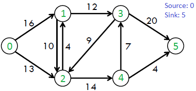
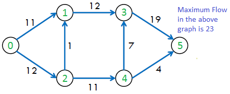

# Ford Fulkerson's Algorithm

## 1. What is the Ford Fulkerson's Algorithm?

The Ford-Fulkerson algorithm is a widely used algorithm to solve the maximum flow problem in a flow network. The maximum flow problem involves determining the maximum amount of flow that can be sent from a source vertex to a sink vertex in a directed weighted graph, subject to capacity constraints on the edges.

## 2. Algorithm for Ford Fulkerson's Algorithm

The following is simple idea of Ford-Fulkerson algorithm:

1. Start with initial flow as 0.
2. While there exists an augmenting path from the source to the sink:  

    - Find an augmenting path using any path-finding algorithm, such as breadth-first search or depth-first search.

    - Determine the amount of flow that can be sent along the augmenting path, which is the minimum residual capacity along the edges of the path.

    - Increase the flow along the augmenting path by the determined amount.

3. Return the maximum flow.

## 3. How Does Ford Fulkerson's Algorithm Work?

The algorithm works by iteratively finding an augmenting path, which is a path from the source to the sink in the residual graph, i.e., the graph obtained by subtracting the current flow from the capacity of each edge. The algorithm then increases the flow along this path by the maximum possible amount, which is the minimum capacity of the edges along the path.

## 4. Problem Description

Given a graph which represents a flow network where every edge has a capacity. Also, given two vertices source ‘s’ and sink ‘t’ in the graph, find the maximum possible flow from s to t with the following constraints:

Flow on an edge doesn’t exceed the given capacity of the edge.
Incoming flow is equal to outgoing flow for every vertex except s and t.

## 5. Examples



The maximum possible flow in the above graph is 23. 



## 6. Manual Run Through

There is no flow in the graph to start with.

To find the maximum flow, the Ford-Fulkerson algorithm must increase flow, but first it needs to find out where the flow can be increased: it must find an augmented path.

The Ford-Fulkerson algorithm actually does not specify how such an augmented path is found (that is why it is often described as a method instead of an algorithm), but we will use Depth First Search (DFS) to find the augmented paths for the Ford-Fulkerson algorithm in this tutorial.

## 7. Implementation

<Tabs>
  <TabItem value="Python" label="Python" default>
  ```python
  # Python program for implementation 
# of Ford Fulkerson algorithm
from collections import defaultdict

# This class represents a directed graph 
# using adjacency matrix representation
class Graph:

	def __init__(self, graph):
		self.graph = graph # residual graph
		self. ROW = len(graph)
		# self.COL = len(gr[0])

	'''Returns true if there is a path from source 's' to sink 't' in
	residual graph. Also fills parent[] to store the path '''

	def BFS(self, s, t, parent):

		# Mark all the vertices as not visited
		visited = [False]*(self.ROW)

		# Create a queue for BFS
		queue = []

		# Mark the source node as visited and enqueue it
		queue.append(s)
		visited[s] = True

		# Standard BFS Loop
		while queue:

			# Dequeue a vertex from queue and print it
			u = queue.pop(0)

			# Get all adjacent vertices of the dequeued vertex u
			# If a adjacent has not been visited, then mark it
			# visited and enqueue it
			for ind, val in enumerate(self.graph[u]):
				if visited[ind] == False and val > 0:
					# If we find a connection to the sink node, 
					# then there is no point in BFS anymore
					# We just have to set its parent and can return true
					queue.append(ind)
					visited[ind] = True
					parent[ind] = u
					if ind == t:
						return True

		# We didn't reach sink in BFS starting 
		# from source, so return false
		return False
			
	
	# Returns the maximum flow from s to t in the given graph
	def FordFulkerson(self, source, sink):

		# This array is filled by BFS and to store path
		parent = [-1]*(self.ROW)

		max_flow = 0 # There is no flow initially

		# Augment the flow while there is path from source to sink
		while self.BFS(source, sink, parent) :

			# Find minimum residual capacity of the edges along the
			# path filled by BFS. Or we can say find the maximum flow
			# through the path found.
			path_flow = float("Inf")
			s = sink
			while(s != source):
				path_flow = min (path_flow, self.graph[parent[s]][s])
				s = parent[s]

			# Add path flow to overall flow
			max_flow += path_flow

			# update residual capacities of the edges and reverse edges
			# along the path
			v = sink
			while(v != source):
				u = parent[v]
				self.graph[u][v] -= path_flow
				self.graph[v][u] += path_flow
				v = parent[v]

		return max_flow


# Create a graph given in the above diagram

graph = [[0, 16, 13, 0, 0, 0],
		[0, 0, 10, 12, 0, 0],
		[0, 4, 0, 0, 14, 0],
		[0, 0, 9, 0, 0, 20],
		[0, 0, 0, 7, 0, 4],
		[0, 0, 0, 0, 0, 0]]

g = Graph(graph)

source = 0; sink = 5

print ("The maximum possible flow is %d " % g.FordFulkerson(source, sink))
  ```
  </TabItem>

  <TabItem value="C++" label="C++">
  ```cpp
 // C++ program for implementation of Ford Fulkerson
// algorithm
#include <iostream>
#include <limits.h>
#include <queue>
#include <string.h>
using namespace std;

// Number of vertices in given graph
#define V 6

/* Returns true if there is a path from source 's' to sink
't' in residual graph. Also fills parent[] to store the
path */
bool bfs(int rGraph[V][V], int s, int t, int parent[])
{
	// Create a visited array and mark all vertices as not
	// visited
	bool visited[V];
	memset(visited, 0, sizeof(visited));

	// Create a queue, enqueue source vertex and mark source
	// vertex as visited
	queue<int> q;
	q.push(s);
	visited[s] = true;
	parent[s] = -1;

	// Standard BFS Loop
	while (!q.empty()) {
		int u = q.front();
		q.pop();

		for (int v = 0; v < V; v++) {
			if (visited[v] == false && rGraph[u][v] > 0) {
				// If we find a connection to the sink node,
				// then there is no point in BFS anymore We
				// just have to set its parent and can return
				// true
				if (v == t) {
					parent[v] = u;
					return true;
				}
				q.push(v);
				parent[v] = u;
				visited[v] = true;
			}
		}
	}

	// We didn't reach sink in BFS starting from source, so
	// return false
	return false;
}

// Returns the maximum flow from s to t in the given graph
int fordFulkerson(int graph[V][V], int s, int t)
{
	int u, v;

	// Create a residual graph and fill the residual graph
	// with given capacities in the original graph as
	// residual capacities in residual graph
	int rGraph[V]
			[V]; // Residual graph where rGraph[i][j]
				// indicates residual capacity of edge
				// from i to j (if there is an edge. If
				// rGraph[i][j] is 0, then there is not)
	for (u = 0; u < V; u++)
		for (v = 0; v < V; v++)
			rGraph[u][v] = graph[u][v];

	int parent[V]; // This array is filled by BFS and to
				// store path

	int max_flow = 0; // There is no flow initially

	// Augment the flow while there is path from source to
	// sink
	while (bfs(rGraph, s, t, parent)) {
		// Find minimum residual capacity of the edges along
		// the path filled by BFS. Or we can say find the
		// maximum flow through the path found.
		int path_flow = INT_MAX;
		for (v = t; v != s; v = parent[v]) {
			u = parent[v];
			path_flow = min(path_flow, rGraph[u][v]);
		}

		// update residual capacities of the edges and
		// reverse edges along the path
		for (v = t; v != s; v = parent[v]) {
			u = parent[v];
			rGraph[u][v] -= path_flow;
			rGraph[v][u] += path_flow;
		}

		// Add path flow to overall flow
		max_flow += path_flow;
	}

	// Return the overall flow
	return max_flow;
}

// Driver program to test above functions
int main()
{
	// Let us create a graph shown in the above example
	int graph[V][V]
		= { { 0, 16, 13, 0, 0, 0 }, { 0, 0, 10, 12, 0, 0 },
			{ 0, 4, 0, 0, 14, 0 }, { 0, 0, 9, 0, 0, 20 },
			{ 0, 0, 0, 7, 0, 4 }, { 0, 0, 0, 0, 0, 0 } };

	cout << "The maximum possible flow is "
		<< fordFulkerson(graph, 0, 5);

	return 0;
}

  ```
  </TabItem>

  <TabItem value="Java" label="Java">
  ```java
  // Java program for implementation of Ford Fulkerson
// algorithm
import java.io.*;
import java.lang.*;
import java.util.*;
import java.util.LinkedList;

class MaxFlow {
	static final int V = 6; // Number of vertices in graph

	/* Returns true if there is a path from source 's' to
	sink 't' in residual graph. Also fills parent[] to
	store the path */
	boolean bfs(int rGraph[][], int s, int t, int parent[])
	{
		// Create a visited array and mark all vertices as
		// not visited
		boolean visited[] = new boolean[V];
		for (int i = 0; i < V; ++i)
			visited[i] = false;

		// Create a queue, enqueue source vertex and mark
		// source vertex as visited
		LinkedList<Integer> queue
			= new LinkedList<Integer>();
		queue.add(s);
		visited[s] = true;
		parent[s] = -1;

		// Standard BFS Loop
		while (queue.size() != 0) {
			int u = queue.poll();

			for (int v = 0; v < V; v++) {
				if (visited[v] == false
					&& rGraph[u][v] > 0) {
					// If we find a connection to the sink
					// node, then there is no point in BFS
					// anymore We just have to set its parent
					// and can return true
					if (v == t) {
						parent[v] = u;
						return true;
					}
					queue.add(v);
					parent[v] = u;
					visited[v] = true;
				}
			}
		}

		// We didn't reach sink in BFS starting from source,
		// so return false
		return false;
	}

	// Returns the maximum flow from s to t in the given
	// graph
	int fordFulkerson(int graph[][], int s, int t)
	{
		int u, v;

		// Create a residual graph and fill the residual
		// graph with given capacities in the original graph
		// as residual capacities in residual graph

		// Residual graph where rGraph[i][j] indicates
		// residual capacity of edge from i to j (if there
		// is an edge. If rGraph[i][j] is 0, then there is
		// not)
		int rGraph[][] = new int[V][V];

		for (u = 0; u < V; u++)
			for (v = 0; v < V; v++)
				rGraph[u][v] = graph[u][v];

		// This array is filled by BFS and to store path
		int parent[] = new int[V];

		int max_flow = 0; // There is no flow initially

		// Augment the flow while there is path from source
		// to sink
		while (bfs(rGraph, s, t, parent)) {
			// Find minimum residual capacity of the edges
			// along the path filled by BFS. Or we can say
			// find the maximum flow through the path found.
			int path_flow = Integer.MAX_VALUE;
			for (v = t; v != s; v = parent[v]) {
				u = parent[v];
				path_flow
					= Math.min(path_flow, rGraph[u][v]);
			}

			// update residual capacities of the edges and
			// reverse edges along the path
			for (v = t; v != s; v = parent[v]) {
				u = parent[v];
				rGraph[u][v] -= path_flow;
				rGraph[v][u] += path_flow;
			}

			// Add path flow to overall flow
			max_flow += path_flow;
		}

		// Return the overall flow
		return max_flow;
	}

	// Driver program to test above functions
	public static void main(String[] args)
		throws java.lang.Exception
	{
		// Let us create a graph shown in the above example
		int graph[][] = new int[][] {
			{ 0, 16, 13, 0, 0, 0 }, { 0, 0, 10, 12, 0, 0 },
			{ 0, 4, 0, 0, 14, 0 }, { 0, 0, 9, 0, 0, 20 },
			{ 0, 0, 0, 7, 0, 4 }, { 0, 0, 0, 0, 0, 0 }
		};
		MaxFlow m = new MaxFlow();

		System.out.println("The maximum possible flow is "
						+ m.fordFulkerson(graph, 0, 5));
	}
}

  ```
  </TabItem>

  <TabItem value="JavaScript" label="JavaScript">
  ```javascript
  <script>

// Javascript program for implementation of Ford
// Fulkerson algorithm

// Number of vertices in graph
let V = 6; 

// Returns true if there is a path from source 
// 's' to sink 't' in residual graph. Also
// fills parent[] to store the path 
function bfs(rGraph, s, t, parent)
{
	
	// Create a visited array and mark all
	// vertices as not visited
	let visited = new Array(V);
	for(let i = 0; i < V; ++i)
		visited[i] = false;

	// Create a queue, enqueue source vertex
	// and mark source vertex as visited
	let queue = [];
	queue.push(s);
	visited[s] = true;
	parent[s] = -1;

	// Standard BFS Loop
	while (queue.length != 0)
	{
		let u = queue.shift();

		for(let v = 0; v < V; v++) 
		{
			if (visited[v] == false && 
				rGraph[u][v] > 0)
			{
				
				// If we find a connection to the sink
				// node, then there is no point in BFS
				// anymore We just have to set its parent
				// and can return true
				if (v == t) 
				{
					parent[v] = u;
					return true;
				}
				queue.push(v);
				parent[v] = u;
				visited[v] = true;
			}
		}
	}

	// We didn't reach sink in BFS starting 
	// from source, so return false
	return false;
}

// Returns the maximum flow from s to t in
// the given graph
function fordFulkerson(graph, s, t)
{
	let u, v;

	// Create a residual graph and fill the
	// residual graph with given capacities
	// in the original graph as residual 
	// capacities in residual graph

	// Residual graph where rGraph[i][j]
	// indicates residual capacity of edge 
	// from i to j (if there is an edge. 
	// If rGraph[i][j] is 0, then there is
	// not)
	let rGraph = new Array(V);

	for(u = 0; u < V; u++)
	{
		rGraph[u] = new Array(V);
		for(v = 0; v < V; v++)
			rGraph[u][v] = graph[u][v];
	}
	
	// This array is filled by BFS and to store path
	let parent = new Array(V);
	
	// There is no flow initially
	let max_flow = 0; 

	// Augment the flow while there 
	// is path from source to sink
	while (bfs(rGraph, s, t, parent))
	{
		
		// Find minimum residual capacity of the edges
		// along the path filled by BFS. Or we can say
		// find the maximum flow through the path found.
		let path_flow = Number.MAX_VALUE;
		for(v = t; v != s; v = parent[v]) 
		{
			u = parent[v];
			path_flow = Math.min(path_flow, 
								rGraph[u][v]);
		}

		// Update residual capacities of the edges and
		// reverse edges along the path
		for(v = t; v != s; v = parent[v]) 
		{
			u = parent[v];
			rGraph[u][v] -= path_flow;
			rGraph[v][u] += path_flow;
		}

		// Add path flow to overall flow
		max_flow += path_flow;
	}

	// Return the overall flow
	return max_flow;
}

// Driver code

// Let us create a graph shown in the above example
let graph = [ [ 0, 16, 13, 0, 0, 0 ], 
			[ 0, 0, 10, 12, 0, 0 ],
			[ 0, 4, 0, 0, 14, 0 ], 
			[ 0, 0, 9, 0, 0, 20 ],
			[ 0, 0, 0, 7, 0, 4 ], 
			[ 0, 0, 0, 0, 0, 0 ] ];
document.write("The maximum possible flow is " + 
			fordFulkerson(graph, 0, 5));


</script>

  ```
  </TabItem>
</Tabs>


## 8. Complexity Analysis

Time complexity of the above algorithm is O(max_flow * E). We run a loop while there is an augmenting path. In worst case, we may add 1 unit flow in every iteration. Therefore the time complexity becomes O(max_flow * E).

Space Complexity :O(V) , as we created queue.

## 9. Residual Network in Ford-Fulkerson

The Ford-Fulkerson algorithm actually works by creating and using something called a residual network, which is a representation of the original graph.

In the residual network, every edge has a residual capacity, which is the original capacity of the edge, minus the the flow in that edge. The residual capacity can be seen as the leftover capacity in an edge with some flow.

## 10. Reversed Edges in Ford-Fulkerson

The Ford-Fulkerson algorithm also uses something called reversed edges to send flow back. This is useful to increase the total flow.To send flow back, in the opposite direction of the edge, a reverse edge is created for each original edge in the network. The Ford-Fulkerson algorithm can then use these reverse edges to send flow in the reverse direction.The idea of a residual network with residual capacity on edges, and the idea of reversed edges, are central to how the Ford-Fulkerson algorithm works, and we will go into more detail about this when we implement the algorithm further down on this page.
