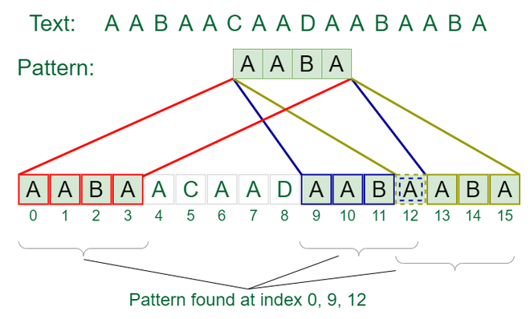

## 1. What is the Knuth-Morris-Pratt (KMP) Algorithm?

The Knuth-Morris-Pratt (KMP) algorithm is an efficient pattern matching algorithm that searches for occurrences of a $word$ $W$ within a main $text string$ $T$ by employing the observation that when a mismatch occurs, the word itself embodies sufficient information to determine where the next match could begin, thus bypassing re-examination of previously matched characters.

## 2. Algorithm for Knuth-Morris-Pratt (KMP)

1. Preprocess the pattern to create an array (LPS array) that stores the length of the longest prefix which is also a suffix.
2. Use the $LPS array$ to skip characters while matching.

## 3. How does the Knuth-Morris-Pratt (KMP) Algorithm work?

- The KMP algorithm preprocesses the pattern to determine the longest prefix which is also a suffix in the pattern itself.
- This preprocessing is used to avoid unnecessary re-evaluation of the characters in the text, making the search process more efficient.

## 4. Problem Description

Given a text string and a pattern string, implement the $Knuth-Morris-Pratt (KMP)$ algorithm to find all occurrences of the pattern in the text.

## 5. Examples

**Example 1:**
```
Input: text = "ABABDABACDABABCABAB", pattern = "ABABCABAB"
Output: Pattern found at index 10
```

**Example 2:**
```
Input: text = "AABAACAADAABAABA", pattern = "AABA"
Output: Pattern found at index 0, Pattern found at index 9, Pattern found at index 12
```

**Explanation of Example 1:**
- The pattern "ABABCABAB" is found in the text "ABABDABACDABABCABAB" starting from index 10.

## Visual Example



## 6. Constraints

- The text and pattern can contain any number of characters.
- All characters are $ASCII$ characters.

## 7. Implementation

<Tabs>
  <TabItem value="Python" label="Python" default>
  <SolutionAuthor name="@ngmuraqrdd"/>
  ```python
  def KMPSearch(pat, txt):
      M = len(pat)
      N = len(txt)

      lps = [0] * M
      j = 0

      computeLPSArray(pat, M, lps)

      i = 0
      while i < N:
          if pat[j] == txt[i]:
              i += 1
              j += 1

          if j == M:
              print("Found pattern at index " + str(i - j))
              j = lps[j - 1]
          elif i < N and pat[j] != txt[i]:
              if j != 0:
                  j = lps[j - 1]
              else:
                  i += 1

  def computeLPSArray(pat, M, lps):
      length = 0
      lps[0] = 0
      i = 1

      while i < M:
          if pat[i] == pat[length]:
              length += 1
              lps[i] = length
              i += 1
          else:
              if length != 0:
                  length = lps[length - 1]
              else:
                  lps[i] = 0
                  i += 1

  # Example usage:
  text = "ABABDABACDABABCABAB"
  pattern = "ABABCABAB"
  KMPSearch(pattern, text)
  ```
  </TabItem>

  <TabItem value="C++" label="C++">
  <SolutionAuthor name="@ngmuraqrdd"/>
  ```cpp
  #include <iostream>
  #include <vector>
  using namespace std;

  void computeLPSArray(string pat, int M, vector<int>& lps) {
      int length = 0;
      lps[0] = 0;
      int i = 1;

      while (i < M) {
          if (pat[i] == pat[length]) {
              length++;
              lps[i] = length;
              i++;
          } else {
              if (length != 0) {
                  length = lps[length - 1];
              } else {
                  lps[i] = 0;
                  i++;
              }
          }
      }
  }

  void KMPSearch(string pat, string txt) {
      int M = pat.size();
      int N = txt.size();

      vector<int> lps(M);
      computeLPSArray(pat, M, lps);

      int i = 0;
      int j = 0;
      while (i < N) {
          if (pat[j] == txt[i]) {
              i++;
              j++;
          }

          if (j == M) {
              cout << "Found pattern at index " << (i - j) << endl;
              j = lps[j - 1];
          } else if (i < N && pat[j] != txt[i]) {
              if (j != 0) {
                  j = lps[j - 1];
              } else {
                  i++;
              }
          }
      }
  }

  int main() {
      string txt = "ABABDABACDABABCABAB";
      string pat = "ABABCABAB";
      KMPSearch(pat, txt);
      return 0;
  }
  ```
  </TabItem>

  <TabItem value="Java" label="Java">
  <SolutionAuthor name="@ngmuraqrdd"/>
  ```java
  public class KMPAlgorithm {
      void KMPSearch(String pat, String txt) {
          int M = pat.length();
          int N = txt.length();

          int lps[] = new int[M];
          int j = 0;

          computeLPSArray(pat, M, lps);

          int i = 0;
          while (i < N) {
              if (pat.charAt(j) == txt.charAt(i)) {
                  i++;
                  j++;
              }
              if (j == M) {
                  System.out.println("Found pattern at index " + (i - j));
                  j = lps[j - 1];
              } else if (i < N && pat.charAt(j) != txt.charAt(i)) {
                  if (j != 0)
                      j = lps[j - 1];
                  else
                      i++;
              }
          }
      }

      void computeLPSArray(String pat, int M, int lps[]) {
          int len = 0;
          int i = 1;
          lps[0] = 0;

          while (i < M) {
              if (pat.charAt(i) == pat.charAt(len)) {
                  len++;
                  lps[i] = len;
                  i++;
              } else {
                  if (len != 0) {
                      len = lps[len - 1];
                  } else {
                      lps[i] = 0;
                      i++;
                  }
              }
          }
      }

      public static void main(String args[]) {
          String txt = "ABABDABACDABABCABAB";
          String pat = "ABABCABAB";
          new KMPAlgorithm().KMPSearch(pat, txt);
      }
  }
  ```
  </TabItem>

  <TabItem value="JavaScript" label="JavaScript">
  <SolutionAuthor name="@ngmuraqrdd"/>
  ```javascript
  function KMPSearch(pat, txt) {
      const M = pat.length;
      const N = txt.length;

      const lps = new Array(M).fill(0);
      computeLPSArray(pat, M, lps);

      let i = 0;
      let j = 0;
      while (i < N) {
          if (pat[j] === txt[i]) {
              i++;
              j++;
          }
          if (j === M) {
              console.log("Found pattern at index " + (i - j));
              j = lps[j - 1];
          } else if (i < N && pat[j] !== txt[i]) {
              if (j !== 0) {
                  j = lps[j - 1];
              } else {
                  i++;
              }
          }
      }
  }

  function computeLPSArray(pat, M, lps) {
      let length = 0;
      let i = 1;

      lps[0] = 0;

      while (i < M) {
          if (pat[i] === pat[length]) {
              length++;
              lps[i] = length;
              i++;
          } else {
              if (length !== 0) {
                  length = lps[length - 1];
              } else {
                  lps[i] = 0;
                  i++;
              }
          }
      }
  }

  // Example usage:
  const text = "ABABDABACDABABCABAB";
  const

 pattern = "ABABCABAB";
  KMPSearch(pattern, text);
  ```
  </TabItem>
</Tabs>

## 8. Complexity Analysis

- **Time Complexity**:
  - Preprocessing the LPS array: $O(M)$
  - Searching the pattern in the text: $O(N)$
  - Overall: $O(M + N)$

- **Space Complexity**: $O(M)$ for the LPS array.

## 9. Advantages and Disadvantages

**Advantages:**
- More efficient than the naive pattern matching algorithm, especially for large texts.
- Avoids redundant comparisons.

**Disadvantages:**
- Slightly more complex to implement than naive algorithms.
- Requires additional space for the LPS array.

## 10. References

- **GFG Problem:** [GFG Problem](https://www.geeksforgeeks.org/kmp-algorithm-for-pattern-searching/)
- **HackerRank Problem:** [HackerRank](https://www.hackerrank.com/challenges/kmp-algorithm/problem)
- **Author's Geeks for Geeks Profile:** [MuraliDharan](https://www.geeksforgeeks.org/user/ngmuraqrdd/)