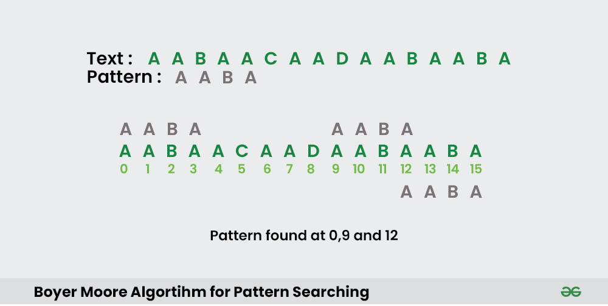

## 1. What is the Boyer-Moore Algorithm?

The Boyer-Moore algorithm is an efficient string searching algorithm that skips sections of the text to find the pattern, making it faster than many other algorithms. It uses two main heuristics: the Bad Character Rule and the Good Suffix Rule, which allow it to skip over sections of the text that do not need to be checked.

## 2. Algorithm for Boyer-Moore

1. Preprocess the pattern to create two arrays (Bad Character and Good Suffix).
2. Use these arrays to skip characters while matching the pattern with the text.

## 3. How does the Boyer-Moore Algorithm work?

- **Bad Character Rule**: When a mismatch occurs, the character in the text causing the mismatch is used to shift the pattern.
- **Good Suffix Rule**: When a mismatch occurs, the pattern is shifted to align with the next possible match of the good suffix (the portion of the pattern that matched just before the mismatch).

## 4. Problem Description

Given a text string and a pattern string, implement the $Boyer-Moore$ algorithm to find all occurrences of the pattern in the text.

## 5. Examples

**Example 1:**
```
Input: text = "ABABDABACDABABCABAB", pattern = "ABABCABAB"
Output: Pattern found at index 10
```

**Example 2:**
```
Input: text = "AABAACAADAABAABA", pattern = "AABA"
Output: Pattern found at index 0, Pattern found at index 9, Pattern found at index 12
```

**Explanation of Example 1:**
- The pattern "ABABCABAB" is found in the text "ABABDABACDABABCABAB" starting from index 10.

## Visual Example



## 6. Constraints

- The text and pattern can contain any number of characters.
- All characters are $ASCII$ characters.

## 7. Implementation

<Tabs>
<TabItem value="Python" label="Python" default>
<SolutionAuthor name="@Aarti_Rathi"/>

```python
 def bad_char_heuristic(pattern):
      bad_char = [-1] * 256
      for i in range(len(pattern)):
          bad_char[ord(pattern[i])] = i
      return bad_char

 def boyer_moore_search(text, pattern):
      m = len(pattern)
      n = len(text)
      bad_char = bad_char_heuristic(pattern)

      s = 0
      while s <= n - m:
          j = m - 1
          while j >= 0 and pattern[j] == text[s + j]:
              j -= 1
          if j < 0:
              print("Pattern found at index " + str(s))
              s += (m - bad_char[ord(text[s + m])] if s + m < n else 1)
          else:
              s += max(1, j - bad_char[ord(text[s + j])])


  # Example usage
  text = "ABABDABACDABABCABAB"
  pattern = "ABABCABAB"
  boyer_moore_search(text, pattern)

```

</TabItem>

<TabItem value="C++" label="C++">
<SolutionAuthor name="@Aarti_Rathi"/>
  
```cpp
  #include <iostream>
  #include <vector>
  using namespace std;

  void badCharHeuristic(string str, int size, int badchar[256]) {
      for (int i = 0; i < 256; i++)
          badchar[i] = -1;
      for (int i = 0; i < size; i++)
          badchar[(int) str[i]] = i;
  }

  void boyerMooreSearch(string txt, string pat) {
      int m = pat.size();
      int n = txt.size();

      int badchar[256];
      badCharHeuristic(pat, m, badchar);

      int s = 0;
      while (s <= (n - m)) {
          int j = m - 1;
          while (j >= 0 && pat[j] == txt[s + j])
              j--;
          if (j < 0) {
              cout << "Pattern found at index " << s << endl;
              s += (s + m < n) ? m - badchar[txt[s + m]] : 1;
          } else
              s += max(1, j - badchar[txt[s + j]]);
      }
  }

  int main() {
      string txt = "ABABDABACDABABCABAB";
      string pat = "ABABCABAB";
      boyerMooreSearch(txt, pat);
      return 0;
  }
  ```
  </TabItem>

  <TabItem value="Java" label="Java">
  <SolutionAuthor name="@Aarti_Rathi"/>
  
  ```java
    
    public class BoyerMooreAlgorithm {
      void badCharHeuristic(char[] str, int size, int badchar[]) {
          for (int i = 0; i < 256; i++)
              badchar[i] = -1;
          for (int i = 0; i < size; i++)
              badchar[(int) str[i]] = i;
      }

      void boyerMooreSearch(char txt[], char pat[]) {
          int m = pat.length;
          int n = txt.length;

          int badchar[] = new int[256];
          badCharHeuristic(pat, m, badchar);

          int s = 0;
          while (s <= (n - m)) {
              int j = m - 1;
              while (j >= 0 && pat[j] == txt[s + j])
                  j--;
              if (j < 0) {
                  System.out.println("Pattern found at index " + s);
                  s += (s + m < n) ? m - badchar[txt[s + m]] : 1;
              } else
                  s += Math.max(1, j - badchar[txt[s + j]]);
          }
      }

      public static void main(String[] args) {
          BoyerMooreAlgorithm bm = new BoyerMooreAlgorithm();
          String txt = "ABABDABACDABABCABAB";
          String pat = "ABABCABAB";
          bm.boyerMooreSearch(txt.toCharArray(), pat.toCharArray());
      }
  }

```
</TabItem>

<TabItem value="JavaScript" label="JavaScript">
<SolutionAuthor name="@Aarti_Rathi"/>

  ```javascript
  
    function badCharHeuristic(str, size) {
      const badChar = new Array(256).fill(-1);
      for (let i = 0; i < size; i++) {
          badChar[str.charCodeAt(i)] = i;
      }
      return badChar;
    }

    function boyerMooreSearch(txt, pat) {
      const m = pat.length;
      const n = txt.length;
      const badChar = badCharHeuristic(pat, m);

      let s = 0;
      while (s <= (n - m)) {
          let j = m - 1;
          while (j >= 0 && pat[j] === txt[s + j])
              j--;
          if (j < 0) {
              console.log("Pattern found at index " + s);
              s += (s + m < n) ? m - badChar[txt.charCodeAt(s + m)] : 1;
          } else
              s += Math.max(1, j - badChar[txt.charCodeAt(s + j)]);
      }
    }

    // Example usage:
    const text = "ABABDABACDABABCABAB";
    const pattern = "ABABCABAB";
    boyerMooreSearch(text, pattern); 
  
```
</TabItem>
</Tabs>

## 8. Complexity Analysis

- **Time Complexity**:
  - Preprocessing the Bad Character and Good Suffix tables: $O(m + |Σ|)$, where $m$ is the length of the pattern and $|Σ|$ is the size of the alphabet.
  - Searching the pattern in the text: $O(n)$ in the best case and $O(mn)$ in the worst case, where $n$ is the length of the text.
  - Overall: Efficient in practice with average time complexity $O(n/m)$.

- **Space Complexity**: $O(m + |Σ|)$ for the Bad Character and Good Suffix tables.

## 9. Advantages and Disadvantages

**Advantages:**
- Very efficient for large texts with small patterns.
- Uses heuristics to skip sections of the text, making it faster than many other algorithms.

**Disadvantages:**
- More complex to implement compared to simpler algorithms like the Naive Pattern Matching algorithm.
- The worst-case time complexity can be higher for certain patterns and texts.

## 10. References

- **GFG Problem:** [GFG Problem](https://www.geeksforgeeks.org/boyer-moore-algorithm-for-pattern-searching/)
- **HackerRank Problem:** [HackerRank](https://www.hackerrank.com/challenges/save-humanity/problem)
- **Author's Geeks for Geeks Profile:** Aarti_Rathi
