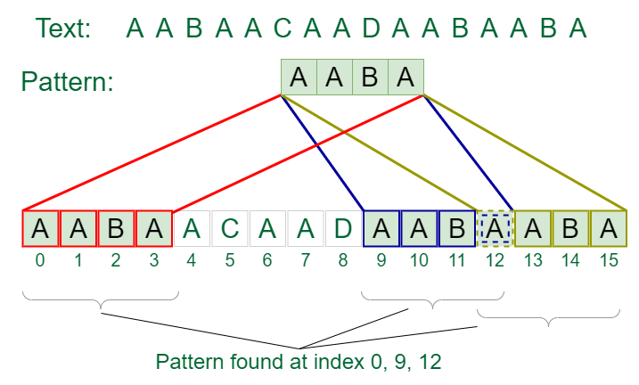

## 1. What is the Naive Pattern Matching Algorithm?

The Naive Pattern Matching algorithm is a straightforward approach for finding occurrences of a pattern string within a text string. It compares the pattern to each substring of the text and checks for a match.

## 2. Algorithm for Naive Pattern Matching

1. Loop through the text, and for each position in the text, check if the pattern matches the substring starting at that position.
2. If a match is found, record the starting index of the match.

## 3. How does the Naive Pattern Matching Algorithm work?

- For each position in the text, compare the substring of the text starting at that position with the pattern.
- If the pattern matches the substring, record the starting index.
- Continue this process until the end of the text is reached.

## 4. Problem Description

Given a text string and a pattern string, implement the Naive Pattern Matching algorithm to find all occurrences of the pattern in the text.

## 5. Examples

**Example 1:**
```
Input: text = "THIS IS A TEST TEXT", pattern = "TEST"
Output: Pattern found at index 10
```

**Example 2:**
```
Input: text = "AABAACAADAABAABA", pattern = "AABA"
Output: Pattern found at index 0, Pattern found at index 9, Pattern found at index 12
```

**Explanation of Example 1:**
- The pattern "TEST" is found in the text "THIS IS A TEST TEXT" at index 10.

## Visual Example



## 6. Constraints

- The text and pattern can contain any number of characters.
- All characters are $ASCII$ characters.

## 7. Implementation

<Tabs>
<TabItem value="Python" label="Python" default>
<SolutionAuthor name="GeeksforGeeks"/>

```python
def naive_pattern_search(text, pattern):
    n = len(text)
    m = len(pattern)
    
    for i in range(n - m + 1):
        j = 0
        while j < m and text[i + j] == pattern[j]:
            j += 1
        if j == m:
            print(f"Pattern found at index {i}")

# Example usage
text = "THIS IS A TEST TEXT"
pattern = "TEST"
naive_pattern_search(text, pattern)

text = "AABAACAADAABAABA"
pattern = "AABA"
naive_pattern_search(text, pattern)
```

</TabItem>

<TabItem value="C++" label="C++">
<SolutionAuthor name="GeeksforGeeks"/>

```cpp
#include <iostream>
#include <string>
using namespace std;

void naivePatternSearch(string txt, string pat) {
    int n = txt.size();
    int m = pat.size();

    for (int i = 0; i <= n - m; i++) {
        int j;
        for (j = 0; j < m; j++)
            if (txt[i + j] != pat[j])
                break;

        if (j == m)
            cout << "Pattern found at index " << i << endl;
    }
}

int main() {
    string txt = "THIS IS A TEST TEXT";
    string pat = "TEST";
    naivePatternSearch(txt, pat);

    txt = "AABAACAADAABAABA";
    pat = "AABA";
    naivePatternSearch(txt, pat);
    return 0;
}
```
</TabItem>

<TabItem value="Java" label="Java">
<SolutionAuthor name="GeeksforGeeks"/>

```java
public class NaivePatternMatching {
    static void naivePatternSearch(String txt, String pat) {
        int n = txt.length();
        int m = pat.length();

        for (int i = 0; i <= n - m; i++) {
            int j;
            for (j = 0; j < m; j++)
                if (txt.charAt(i + j) != pat.charAt(j))
                    break;

            if (j == m)
                System.out.println("Pattern found at index " + i);
        }
    }

    public static void main(String[] args) {
        String txt = "THIS IS A TEST TEXT";
        String pat = "TEST";
        naivePatternSearch(txt, pat);

        txt = "AABAACAADAABAABA";
        pat = "AABA";
        naivePatternSearch(txt, pat);
    }
}
```
</TabItem>

<TabItem value="JavaScript" label="JavaScript">
<SolutionAuthor name="GeeksforGeeks"/>

```javascript
function naivePatternSearch(txt, pat) {
    const n = txt.length;
    const m = pat.length;

    for (let i = 0; i <= n - m; i++) {
        let j;
        for (j = 0; j < m; j++) {
            if (txt[i + j] !== pat[j]) {
                break;
            }
        }
        if (j === m) {
            console.log(`Pattern found at index ${i}`);
        }
    }
}

// Example usage:
let text = "THIS IS A TEST TEXT";
let pattern = "TEST";
naivePatternSearch(text, pattern);

text = "AABAACAADAABAABA";
pattern = "AABA";
naivePatternSearch(text, pattern);
```
</TabItem>
</Tabs>

## 8. Complexity Analysis

- **Time Complexity**:
  - Worst-case: $O((n-m+1) \cdot m)$, where $n$ is the length of the text and $m$ is the length of the pattern.
  - Best-case: $O(n - m + 1)$ when all characters of the pattern are different.

- **Space Complexity**: $O(1)$ as it uses a constant amount of extra space.

## 9. Advantages and Disadvantages

**Advantages:**
- Simple and easy to understand and implement.
- No preprocessing required.

**Disadvantages:**
- Inefficient for large texts and patterns with many repeated characters.
- Higher time complexity compared to more advanced algorithms like Boyer-Moore and KMP.

## 10. References

- **GFG Problem:** [GFG Problem](https://www.geeksforgeeks.org/naive-algorithm-for-pattern-searching/)
- **HackerRank Problem:** [HackerRank](https://www.hackerrank.com/challenges/kmp-fp/problem)
- **Author's Geeks for Geeks Profile:** GeeksforGeeks
