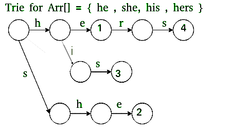

## 1. What is the Aho-Corasick Algorithm?

The Aho-Corasick algorithm is a powerful and efficient string searching algorithm that can locate multiple patterns in a text simultaneously. It constructs a finite state machine that resembles a digital tree with additional links between nodes to allow fast transitions between different patterns.

## 2. Algorithm for Aho-Corasick

1. Build a Trie from the set of patterns.
2. Construct failure links to allow the algorithm to skip unnecessary comparisons.
3. Traverse the text using the Trie and the failure links to find all occurrences of the patterns.

## 3. How does the Aho-Corasick Algorithm work?

- **Trie Construction**: Insert all the patterns into a Trie.
- **Failure Links**: Create links that enable skipping sections of the Trie that do not match the current character in the text.
- **Search**: Traverse the text using the Trie, following the failure links whenever a mismatch occurs.

## 4. Problem Description

Given a text string and multiple pattern strings, implement the $Aho-Corasick$ algorithm to find all occurrences of the patterns in the text.

## 5. Examples

**Example 1:**
```
Input: text = "THIS IS A TEST TEXT", patterns = ["TEST", "TEXT"]
Output: Pattern 'TEST' found at index 10
        Pattern 'TEXT' found at index 15
```

**Example 2:**
```
Input: text = "AABAACAADAABAABA", patterns = ["AABA", "CAAD"]
Output: Pattern 'AABA' found at index 0
        Pattern 'AABA' found at index 9
        Pattern 'AABA' found at index 12
        Pattern 'CAAD' found at index 5
```

**Explanation of Example 1:**
- The patterns "TEST" and "TEXT" are found in the text "THIS IS A TEST TEXT" starting from index 10 and 15, respectively.

## Visual Example



## 6. Constraints

- The text and patterns can contain any number of characters.
- All characters are $ASCII$ characters.

## 7. Implementation

<Tabs>
<TabItem value="Python" label="Python" default>
<SolutionAuthor name="@AyushGovil"/>

```python
from collections import deque, defaultdict

class AhoCorasick:
    def __init__(self, keywords):
        self.trie = {}
        self.out = defaultdict(list)
        self.fail = {}
        self.build_trie(keywords)
        self.build_automaton()
        
    def build_trie(self, keywords):
        for keyword in keywords:
            node = self.trie
            for char in keyword:
                node = node.setdefault(char, {})
            node['#'] = keyword
    
    def build_automaton(self):
        queue = deque()
        for key in self.trie:
            self.fail[key] = self.trie
            queue.append(key)
        while queue:
            current = queue.popleft()
            for key in self.trie[current]:
                if key == '#': 
                    continue
                fail_node = self.fail[current]
                while key not in fail_node and fail_node is not self.trie:
                    fail_node = self.fail[fail_node]
                self.fail[key] = fail_node.get(key, self.trie)
                queue.append(key)
            self.out[current].extend(self.out[self.fail[current]])
            if '#' in self.trie[current]:
                self.out[current].append(self.trie[current]['#'])
    
    def search(self, text):
        node = self.trie
        for i, char in enumerate(text):
            while char not in node and node is not self.trie:
                node = self.fail[node]
            node = node.get(char, self.trie)
            if '#' in node:
                print(f"Pattern '{node['#']}' found at index {i - len(node['#']) + 1}")

# Example usage:
text = "THIS IS A TEST TEXT"
patterns = ["TEST", "TEXT"]
ac = AhoCorasick(patterns)
ac.search(text)
```

</TabItem>

<TabItem value="C++" label="C++">
<SolutionAuthor name="@AyushGovil"/>

```cpp
#include <iostream>
#include <vector>
#include <queue>
#include <unordered_map>
using namespace std;

class AhoCorasick {
    struct TrieNode {
        unordered_map<char, TrieNode*> children;
        TrieNode* fail;
        vector<string> output;
    };
    TrieNode* root;

public:
    AhoCorasick(const vector<string>& keywords) {
        root = new TrieNode();
        buildTrie(keywords);
        buildAutomaton();
    }

    void buildTrie(const vector<string>& keywords) {
        for (const auto& keyword : keywords) {
            TrieNode* node = root;
            for (char c : keyword) {
                if (node->children.find(c) == node->children.end()) {
                    node->children[c] = new TrieNode();
                }
                node = node->children[c];
            }
            node->output.push_back(keyword);
        }
    }

    void buildAutomaton() {
        queue<TrieNode*> q;
        root->fail = root;
        for (auto& pair : root->children) {
            pair.second->fail = root;
            q.push(pair.second);
        }
        while (!q.empty()) {
            TrieNode* current = q.front();
            q.pop();
            for (auto& pair : current->children) {
                char c = pair.first;
                TrieNode* child = pair.second;
                TrieNode* fail = current->fail;
                while (fail != root && fail->children.find(c) == fail->children.end()) {
                    fail = fail->fail;
                }
                if (fail->children.find(c) != fail->children.end()) {
                    child->fail = fail->children[c];
                } else {
                    child->fail = root;
                }
                child->output.insert(child->output.end(), child->fail->output.begin(), child->fail->output.end());
                q.push(child);
            }
        }
    }

    void search(const string& text) {
        TrieNode* node = root;
        for (int i = 0; i < text.size(); i++) {
            while (node != root && node->children.find(text[i]) == node->children.end()) {
                node = node->fail;
            }
            if (node->children.find(text[i]) != node->children.end()) {
                node = node->children[text[i]];
            } else {
                node = root;
            }
            if (!node->output.empty()) {
                for (const string& pattern : node->output) {
                    cout << "Pattern '" << pattern << "' found at index " << i - pattern.size() + 1 << endl;
                }
            }
        }
    }
};

// Example usage:
int main() {
    string text = "THIS IS A TEST TEXT";
    vector<string> patterns = {"TEST", "TEXT"};
    AhoCorasick ac(patterns);
    ac.search(text);
    return 0;
}
```
</TabItem>

<TabItem value="Java" label="Java">
<SolutionAuthor name="@AyushGovil"/>

```java
import java.util.*;

public class AhoCorasick {
    private static class TrieNode {
        Map<Character, TrieNode> children = new HashMap<>();
        TrieNode fail;
        List<String> output = new ArrayList<>();
    }

    private TrieNode root;

    public AhoCorasick(List<String> keywords) {
        root = new TrieNode();
        buildTrie(keywords);
        buildAutomaton();
    }

    private void buildTrie(List<String> keywords) {
        for (String keyword : keywords) {
            TrieNode node = root;
            for (char c : keyword.toCharArray()) {
                node = node.children.computeIfAbsent(c, k -> new TrieNode());
            }
            node.output.add(keyword);
        }
    }

    private void buildAutomaton() {
        Queue<TrieNode> queue = new LinkedList<>();
        root.fail = root;
        for (TrieNode node : root.children.values()) {
            node.fail = root;
            queue.add(node);
        }
        while (!queue.isEmpty()) {
            TrieNode current = queue.poll();
            for (Map.Entry<Character, TrieNode> entry : current.children.entrySet()) {
                char c = entry.getKey();
                TrieNode child = entry.getValue();
                TrieNode fail = current.fail;
                while (fail != root && !fail.children.containsKey(c)) {
                    fail = fail.fail;
                }
                if (fail.children.containsKey(c)) {
                    child.fail = fail.children.get(c);
                } else {
                    child.fail = root;
                }
                child.output.addAll(child.fail.output);
                queue.add(child);
            }
        }
    }

    public void search(String text) {
        TrieNode node = root;
        for (int i = 0; i < text.length(); i++) {
            while (node != root && !node.children.containsKey(text.charAt(i))) {
                node = node.fail;


            }
            if (node.children.containsKey(text.charAt(i))) {
                node = node.children.get(text.charAt(i));
            } else {
                node = root;
            }
            if (!node.output.isEmpty()) {
                for (String pattern : node.output) {
                    System.out.println("Pattern '" + pattern + "' found at index " + (i - pattern.length() + 1));
                }
            }
        }
    }

    public static void main(String[] args) {
        String text = "THIS IS A TEST TEXT";
        List<String> patterns = Arrays.asList("TEST", "TEXT");
        AhoCorasick ac = new AhoCorasick(patterns);
        ac.search(text);
    }
}
```
</TabItem>

<TabItem value="JavaScript" label="JavaScript">
<SolutionAuthor name="@AyushGovil"/>

```javascript
class AhoCorasick {
    constructor(keywords) {
        this.trie = {};
        this.out = {};
        this.fail = {};
        this.buildTrie(keywords);
        this.buildAutomaton();
    }

    buildTrie(keywords) {
        for (const keyword of keywords) {
            let node = this.trie;
            for (const char of keyword) {
                if (!(char in node)) {
                    node[char] = {};
                }
                node = node[char];
            }
            node['#'] = keyword;
        }
    }

    buildAutomaton() {
        const queue = [];
        for (const key in this.trie) {
            this.fail[key] = this.trie;
            queue.push(this.trie[key]);
        }

        while (queue.length > 0) {
            const current = queue.shift();
            for (const key in current) {
                if (key === '#') continue;
                let failNode = this.fail[current] || this.trie;
                while (failNode !== this.trie && !(key in failNode)) {
                    failNode = this.fail[failNode];
                }
                this.fail[current[key]] = failNode[key] || this.trie;
                queue.push(current[key]);
            }
        }
    }

    search(text) {
        let node = this.trie;
        for (let i = 0; i < text.length; i++) {
            const char = text[i];
            while (!(char in node) && node !== this.trie) {
                node = this.fail[node];
            }
            node = node[char] || this.trie;
            if ('#' in node) {
                console.log(`Pattern '${node['#']}' found at index ${i - node['#'].length + 1}`);
            }
        }
    }
}

// Example usage:
const text = "THIS IS A TEST TEXT";
const patterns = ["TEST", "TEXT"];
const ac = new AhoCorasick(patterns);
ac.search(text);
```
</TabItem>
</Tabs>

## 8. Complexity Analysis

- **Time Complexity**:
  - Preprocessing (building Trie and failure links): $O(m)$ where $m$ is the total length of all patterns.
  - Searching: $O(n + z)$ where $n$ is the length of the text and $z$ is the number of occurrences of the patterns.
  - Overall: Efficient for multiple pattern matching.

- **Space Complexity**: $O(m)$ for the Trie and failure links.

## 9. Advantages and Disadvantages

**Advantages:**
- Efficient for searching multiple patterns simultaneously.
- Uses Trie and failure links to minimize unnecessary comparisons.

**Disadvantages:**
- More complex to implement compared to simpler algorithms.
- Higher space complexity due to the construction of the Trie and failure links.

## 10. References

- **GFG Problem:** [GFG Problem](https://www.geeksforgeeks.org/aho-corasick-algorithm-pattern-searching/)
- **Author's Geeks for Geeks Profile:** Ayush Govil
