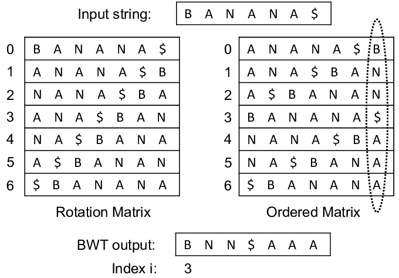

## 1. What is the Burrows-Wheeler Transform (BWT)?

The Burrows-Wheeler Transform (BWT) is an algorithm used to transform a string into a form that is more amenable to compression. The BWT reorganizes the input string into runs of similar characters, which can then be more effectively compressed by other algorithms. It is particularly useful in data compression techniques and bioinformatics for sequence analysis.

## 2. Algorithm for Burrows-Wheeler Transform

1. Generate all rotations of the input string.
2. Sort the rotations lexicographically.
3. Take the last column of the sorted rotations to form the BWT output.

## 3. How does the Burrows-Wheeler Transform work?

- **Generate Rotations**: Create all possible rotations of the input string.
- **Sort Rotations**: Sort the generated rotations in lexicographical order.
- **Last Column**: Extract the last column from the sorted rotations to form the transformed string.

## 4. Problem Description

Given a text string, implement the Burrows-Wheeler Transform (BWT) to obtain the transformed string.

## 5. Examples

**Example 1:**
```
Input: text = "BANANA"
Output: BWT = "ANNBAA"
```

**Example 2:**
```
Input: text = "GEEKSFORGEEKS"
Output: BWT = "SKREEEGKESOF"
```

**Explanation of Example 1:**
- The rotations of "BANANA" are:
  ```
  BANANA
  ANANAB
  NANABA
  ANABAN
  NABANA
  ABANAN
  ```
- Sorting the rotations lexicographically:
  ```
  ABANAN
  ANABAN
  ANANAB
  BANANA
  NABANA
  NANABA
  ```
- The last column of the sorted rotations is "ANNBAA", which is the BWT of "BANANA".

## Visual Example



## 6. Constraints

- The text can contain any number of characters.
- All characters are $ASCII$ characters.

## 7. Implementation

<Tabs>
<TabItem value="Python" label="Python" default>
<SolutionAuthor name="@GeeksforGeeks"/>

```python
def burrows_wheeler_transform(text):
    n = len(text)
    rotations = [text[i:] + text[:i] for i in range(n)]
    rotations.sort()
    bwt = ''.join(rotation[-1] for rotation in rotations)
    return bwt

# Example usage:
text = "BANANA"
bwt = burrows_wheeler_transform(text)
print("BWT =", bwt)
```

</TabItem>

<TabItem value="C++" label="C++">
<SolutionAuthor name="@GeeksforGeeks"/>

```cpp
#include <iostream>
#include <algorithm>
#include <vector>
using namespace std;

string burrows_wheeler_transform(const string &text) {
    int n = text.size();
    vector<string> rotations(n);
    for (int i = 0; i < n; i++) {
        rotations[i] = text.substr(i) + text.substr(0, i);
    }
    sort(rotations.begin(), rotations.end());
    string bwt;
    for (const auto &rotation : rotations) {
        bwt += rotation.back();
    }
    return bwt;
}

// Example usage:
int main() {
    string text = "BANANA";
    string bwt = burrows_wheeler_transform(text);
    cout << "BWT = " << bwt << endl;
    return 0;
}
```
</TabItem>

<TabItem value="Java" label="Java">
<SolutionAuthor name="@GeeksforGeeks"/>

```java
import java.util.Arrays;

public class BurrowsWheelerTransform {

    public static String burrowsWheelerTransform(String text) {
        int n = text.length();
        String[] rotations = new String[n];
        for (int i = 0; i < n; i++) {
            rotations[i] = text.substring(i) + text.substring(0, i);
        }
        Arrays.sort(rotations);
        StringBuilder bwt = new StringBuilder();
        for (String rotation : rotations) {
            bwt.append(rotation.charAt(n - 1));
        }
        return bwt.toString();
    }

    // Example usage:
    public static void main(String[] args) {
        String text = "BANANA";
        String bwt = burrowsWheelerTransform(text);
        System.out.println("BWT = " + bwt);
    }
}
```
</TabItem>

<TabItem value="JavaScript" label="JavaScript">
<SolutionAuthor name="@GeeksforGeeks"/>

```javascript
function burrowsWheelerTransform(text) {
    const n = text.length;
    const rotations = [];
    for (let i = 0; i < n; i++) {
        rotations.push(text.slice(i) + text.slice(0, i));
    }
    rotations.sort();
    let bwt = '';
    for (const rotation of rotations) {
        bwt += rotation.charAt(n - 1);
    }
    return bwt;
}

// Example usage:
const text = "BANANA";
const bwt = burrowsWheelerTransform(text);
console.log("BWT =", bwt);
```
</TabItem>
</Tabs>

## 8. Complexity Analysis

- **Time Complexity**:
  - Generating rotations: $O(n^2)$ where $n$ is the length of the text.
  - Sorting rotations: $O(n \log n)$.
  - Overall: $O(n^2)$ due to the rotations generation step.

- **Space Complexity**: $O(n^2)$ for storing all rotations.

## 9. Advantages and Disadvantages

**Advantages:**
- Makes the input string more compressible.
- Useful in various applications, including data compression and bioinformatics.

**Disadvantages:**
- High space complexity due to storing all rotations.
- Higher time complexity compared to some other string transformation algorithms.

## 10. References

- **GFG Problem:** [GFG Problem](https://www.geeksforgeeks.org/burrows-wheeler-data-transform-algorithm/)
- **Author's Geeks for Geeks Profile:** GeeksforGeeks
