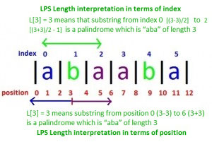

## 1. What is Manacher's Algorithm?

Manacher's Algorithm is an efficient algorithm used to find the longest palindromic substring in a given string. It operates in linear time, making it significantly faster than the traditional approach which operates in quadratic time.

## 2. Algorithm for Manacher's Algorithm

1. Preprocess the string to handle even-length palindromes by inserting a unique character (e.g., `#`) between every character and at the boundaries.
2. Use the preprocessed string to compute the length of the palindromes centered at each character using a palindrome expansion approach.
3. Track the maximum length palindrome and its center to determine the longest palindromic substring.

## 3. How does Manacher's Algorithm work?

- **Preprocessing**: Convert the string `s` to a new string `t` by inserting a unique character `#` between each character of `s` and adding boundary characters at the start and end.
- **Palindrome Expansion**: Use the preprocessed string `t` to compute an array `p` where `p[i]` gives the length of the palindrome centered at `t[i]`.
- **Longest Palindromic Substring**: Find the maximum value in the array `p` to get the longest palindromic substring in the original string `s`.

## 4. Problem Description

Given a text string, implement Manacher's Algorithm to find the longest palindromic substring.

## 5. Examples

**Example 1:**
```
Input: text = "babad"
Output: "bab" (or "aba")
```

**Example 2:**
```
Input: text = "cbbd"
Output: "bb"
```

**Explanation of Example 1:**
- The longest palindromic substring in "babad" is "bab" or "aba".

## Visual Example



## 6. Constraints

- The text can contain any number of characters.
- All characters are $ASCII$ characters.

## 7. Implementation

<Tabs>
<TabItem value="Python" label="Python" default>
<SolutionAuthor name="@Anurag Singh"/>

```python
def preprocess(s):
    return '#' + '#'.join(s) + '#'

def manachers_algorithm(s):
    t = preprocess(s)
    n = len(t)
    p = [0] * n
    c = 0
    r = 0
    for i in range(n):
        mirr = 2 * c - i
        if i < r:
            p[i] = min(r - i, p[mirr])
        while i + p[i] + 1 < n and i - p[i] - 1 >= 0 and t[i + p[i] + 1] == t[i - p[i] - 1]:
            p[i] += 1
        if i + p[i] > r:
            c = i
            r = i + p[i]
    max_len = max(p)
    center_index = p.index(max_len)
    start = (center_index - max_len) // 2
    return s[start:start + max_len]

# Example usage:
text = "babad"
result = manachers_algorithm(text)
print("Longest Palindromic Substring:", result)
```

</TabItem>

<TabItem value="C++" label="C++">
<SolutionAuthor name="@Anurag Singh"/>

```cpp
#include <iostream>
#include <vector>
using namespace std;

string preprocess(const string &s) {
    string t = "#";
    for (char c : s) {
        t += c;
        t += "#";
    }
    return t;
}

string manachers_algorithm(const string &s) {
    string t = preprocess(s);
    int n = t.size();
    vector<int> p(n, 0);
    int c = 0, r = 0;
    for (int i = 0; i < n; i++) {
        int mirr = 2 * c - i;
        if (i < r)
            p[i] = min(r - i, p[mirr]);
        while (i + p[i] + 1 < n && i - p[i] - 1 >= 0 && t[i + p[i] + 1] == t[i - p[i] - 1])
            p[i]++;
        if (i + p[i] > r) {
            c = i;
            r = i + p[i];
        }
    }
    int max_len = 0, center_index = 0;
    for (int i = 0; i < n; i++) {
        if (p[i] > max_len) {
            max_len = p[i];
            center_index = i;
        }
    }
    int start = (center_index - max_len) / 2;
    return s.substr(start, max_len);
}

// Example usage:
int main() {
    string text = "babad";
    string result = manachers_algorithm(text);
    cout << "Longest Palindromic Substring: " << result << endl;
    return 0;
}
```
</TabItem>

<TabItem value="Java" label="Java">
<SolutionAuthor name="@Anurag Singh"/>

```java
public class ManachersAlgorithm {

    private static String preprocess(String s) {
        StringBuilder t = new StringBuilder("#");
        for (char c : s.toCharArray()) {
            t.append(c).append("#");
        }
        return t.toString();
    }

    public static String manachersAlgorithm(String s) {
        String t = preprocess(s);
        int n = t.length();
        int[] p = new int[n];
        int c = 0, r = 0;
        for (int i = 0; i < n; i++) {
            int mirr = 2 * c - i;
            if (i < r) {
                p[i] = Math.min(r - i, p[mirr]);
            }
            while (i + p[i] + 1 < n && i - p[i] - 1 >= 0 && t.charAt(i + p[i] + 1) == t.charAt(i - p[i] - 1)) {
                p[i]++;
            }
            if (i + p[i] > r) {
                c = i;
                r = i + p[i];
            }
        }
        int max_len = 0, center_index = 0;
        for (int i = 0; i < n; i++) {
            if (p[i] > max_len) {
                max_len = p[i];
                center_index = i;
            }
        }
        int start = (center_index - max_len) / 2;
        return s.substring(start, start + max_len);
    }

    // Example usage:
    public static void main(String[] args) {
        String text = "babad";
        String result = manachersAlgorithm(text);
        System.out.println("Longest Palindromic Substring: " + result);
    }
}
```
</TabItem>

<TabItem value="JavaScript" label="JavaScript">
<SolutionAuthor name="@Anurag Singh"/>

```javascript
function preprocess(s) {
    return '#' + s.split('').join('#') + '#';
}

function manachersAlgorithm(s) {
    const t = preprocess(s);
    const n = t.length;
    const p = new Array(n).fill(0);
    let c = 0, r = 0;
    for (let i = 0; i < n; i++) {
        const mirr = 2 * c - i;
        if (i < r) {
            p[i] = Math.min(r - i, p[mirr]);
        }
        while (i + p[i] + 1 < n && i - p[i] - 1 >= 0 && t[i + p[i] + 1] === t[i - p[i] - 1]) {
            p[i]++;
        }
        if (i + p[i] > r) {
            c = i;
            r = i + p[i];
        }
    }
    let maxLen = 0;
    let centerIndex = 0;
    for (let i = 0; i < n; i++) {
        if (p[i] > maxLen) {
            maxLen = p[i];
            centerIndex = i;
        }
    }
    const start = (centerIndex - maxLen) / 2;
    return s.substring(start, start + maxLen);
}

// Example usage:
const text = "babad";
const result = manachersAlgorithm(text);
console.log("Longest Palindromic Substring:", result);
```
</TabItem>
</Tabs>

## 8. Complexity Analysis

- **Time Complexity**: $O(n)$, where $n$ is the length of the preprocessed string.
- **Space Complexity**: $O(n)$ for the arrays used.

## 9. Advantages and Disadvantages

**Advantages:**
- Linear time complexity.
- Efficient for finding the longest palindromic

 substring.

**Disadvantages:**
- Requires preprocessing which increases the space complexity.

## 10. References

- **GFG Problem:** [GFG Problem](https://www.geeksforgeeks.org/manachers-algorithm-linear-time-longest-palindromic-substring-part-1/)
- **Author's Geeks for Geeks Profile:** Anurag Singh
