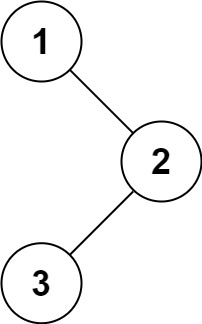

## Problem Description
Given the root of a binary tree, return the preorder traversal of its nodes' values.

### Examples

**Example 1:**

```
Input: root = [1,null,2,3]
Output: [1,2,3]
```

**Example 2:**
```
Input: root = []
Output: []
```

**Example 3:**
```
Input: root = [1]
Output: [1]
```


### Constraints
- The number of nodes in the tree is in the range [0, 100].
- `-1000 <= Node.val <= 1000`

## Solution for Binary Tree Pre Order Traversal
  
### Intuition
- Recursive is very easy try with iterative way

### Code in Different Languages


<Tabs>
  <TabItem value="Python" label="Python">
  <SolutionAuthor name="@parikhitkurmi"/>
    
   ```python
//python

# Definition for a binary tree node.
# class TreeNode:
#     def __init__(self, val=0, left=None, right=None):
#         self.val = val
#         self.left = left
#         self.right = right
class Solution:
    def preorderTraversal(self, root: Optional[TreeNode]) -> List[int]:
        L=[]
        def pot(node):
            if node is None:
                return
            L.append(node.val)
            pot(node.left)
            pot(node.right)
            return L
        return pot(root)

```
  </TabItem>
  <TabItem value="Java" label="Java">
  <SolutionAuthor name="@parikhitkurmi"/>

   ```java
//java


/**
 * Definition for a binary tree node.
 * public class TreeNode {
 *     int val;
 *     TreeNode left;
 *     TreeNode right;
 *     TreeNode() {}
 *     TreeNode(int val) { this.val = val; }
 *     TreeNode(int val, TreeNode left, TreeNode right) {
 *         this.val = val;
 *         this.left = left;
 *         this.right = right;
 *     }
 * }
 */
class Solution {
    List<Integer> result = new ArrayList<>();
    public List<Integer> preorderTraversal(TreeNode root) {
        preOrder(root);
        return result;
    }

    private void preOrder(TreeNode node){
        if(node == null){
            return;
        }

        result.add(node.val);
        preOrder(node.left);
        preOrder(node.right);
    }
}


```
</TabItem>
<TabItem value="C++" label="C++">
<SolutionAuthor name="@parikhitkurmi"/>

   ```cpp
//cpp

/**
 * Definition for a binary tree node.
 * struct TreeNode {
 *     int val;
 *     TreeNode *left;
 *     TreeNode *right;
 *     TreeNode() : val(0), left(nullptr), right(nullptr) {}
 *     TreeNode(int x) : val(x), left(nullptr), right(nullptr) {}
 *     TreeNode(int x, TreeNode *left, TreeNode *right) : val(x), left(left), right(right) {}
 * };
 */
class Solution {
public:


vector<int>ans ;
void Preorder(TreeNode* root) {
    if(!root) 
    return ;

    // NLR
    ans.push_back(root->val) ;
    Preorder(root->left);
    Preorder(root->right) ;

} 
    vector<int> preorderTraversal(TreeNode* root) {

        Preorder(root) ;
        return ans ;
        
    }
};

```

  </TabItem>
</Tabs>


## References

- **LeetCode Problem:** [Binary Tree Preorder Traversal](https://leetcode.com/problems/binary-tree-preorder-traversal/)
- **Solution Link:** [Binary Tree Preorder Traversal](https://leetcode.com/problems/binary-tree-preorder-traversal/submissions/)
- **Authors GeeksforGeeks Profile:** [parikhit kurmi](https://www.geeksforgeeks.org/user/sololeveler673/)
- **Authors Leetcode:** [parikhit kurmi](https://leetcode.com/u/parikhitkurmi14/)

