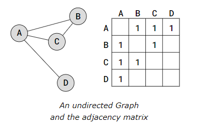
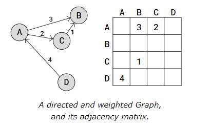
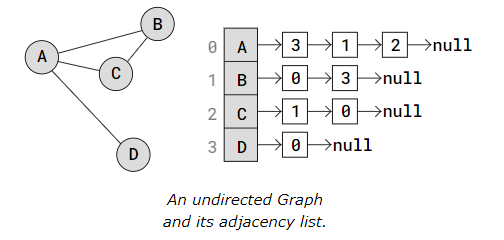
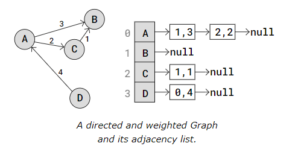

In this tutorial, we will learn about graphs in Data Structures and Algorithms. We will discuss what graphs are, how they are used, and why they are important.

## Graphs in Programming

Graph Data Structure is a collection of nodes connected by edges. It’s used to represent relationships between different entities. Graph algorithms are methods used to manipulate and analyze graphs, solving various problems like finding the shortest path or detecting cycles.

Graph is a non-linear data structure consisting of vertices and edges. The vertices are sometimes also referred to as nodes and the edges are lines or arcs that connect any two nodes in the graph. More formally a Graph is composed of a set of vertices( V ) and a set of edges( E ). The graph is denoted by G(V, E).

## Components of a Graph

- Vertices: Vertices are the fundamental units of the graph. Sometimes, vertices are also known as vertex or nodes. Every node/vertex can be labeled or unlabeled.
- Edges: Edges are drawn or used to connect two nodes of the graph. It can be ordered pair of nodes in a directed graph. Edges can connect any two nodes in any possible way. There are no rules. Sometimes, edges are also known as arcs. Every edge can be labelled/unlabelled.

## Graph Representation

### Adjacency Matrix Graph Representation

The Adjacency Matrix is a 2D array (matrix) where each cell on index (i,j) stores information about the edge from vertex i to vertex j.

Below is a Graph with the Adjacency Matrix representation next to it.



The adjacency matrix above represents an undirected Graph, so the values '1' only tells us where the edges are. Also, the values in the adjacency matrix is symmetrical because the edges go both ways (undirected Graph).

To create a directed Graph with an adjacency matrix, we must decide which vertices the edges go from and to, by inserting the value at the correct indexes (i,j). To represent a weighted Graph we can put other values than '1' inside the adjacency matrix.

Below is a directed and weighted Graph with the Adjacency Matrix representation next to it.



In the adjacency matrix above, the value 3 on index (0,1) tells us there is an edge from vertex A to vertex B, and the weight for that edge is 3.

As you can see, the weights are placed directly into the adjacency matrix for the correct edge, and for a directed Graph, the adjacency matrix does not have to be symmetric.

### Adjacency List Graph Representation

In case we have a 'sparse' Graph with many vertices, we can save space by using an Adjacency List compared to using an Adjacency Matrix, because an Adjacency Matrix would reserve a lot of memory on empty Array elements for edges that don't exist.

A 'sparse' Graph is a Graph where each vertex only has edges to a small portion of the other vertices in the Graph.

An Adjacency List has an array that contains all the vertices in the Graph, and each vertex has a Linked List (or Array) with the vertex's edges.



In the adjacency list above, the vertices A to D are placed in an Array, and each vertex in the array has its index written right next to it.

Each vertex in the Array has a pointer to a Linked List that represents that vertex's edges. More specifically, the Linked List contains the indexes to the adjacent (neighbor) vertices.

So for example, vertex A has a link to a Linked List with values 3, 1, and 2. These values are the indexes to A's adjacent vertices D, B, and C.

An Adjacency List can also represent a directed and weighted Graph, like this:



In the Adjacency List above, vertices are stored in an Array. Each vertex has a pointer to a Linked List with edges stored as i,w, where i is the index of the vertex the edge goes to, and w is the weight of that edge.

Node D for example, has a pointer to a Linked List with an edge to vertex A. The values 0,4 means that vertex D has an edge to vertex on index 0 (vertex A), and the weight of that edge is 4.


Here is an example of a basic graph in some programming languages:

<Tabs>
  <TabItem value="javascript" label="JavaScript">   
    ```javascript
    class Graph {
    constructor(size) {
        this.size = size;
        this.adjMatrix = Array.from({ length: size }, () => Array(size).fill(0));
        this.vertexData = Array(size).fill('');
    }

    addEdge(u, v) {
        if (u >= 0 && u < this.size && v >= 0 && v < this.size) {
            this.adjMatrix[u][v] = 1;
            this.adjMatrix[v][u] = 1;
        }
    }

    addVertexData(vertex, data) {
        if (vertex >= 0 && vertex < this.size) {
            this.vertexData[vertex] = data;
        }
    }

    printGraph() {
        console.log("Adjacency Matrix:");
        for (let i = 0; i < this.size; i++) {
            console.log(this.adjMatrix[i].join(' '));
        }

        console.log("\nVertex Data:");
        for (let i = 0; i < this.size; i++) {
            console.log(`Vertex ${i}: ${this.vertexData[i]}`);
        }
    }
}

// Example usage:
const g = new Graph(4);
g.addVertexData(0, 'A');
g.addVertexData(1, 'B');
g.addVertexData(2, 'C');
g.addVertexData(3, 'D');
g.addEdge(0, 1);  // A - B
g.addEdge(0, 2);  // A - C
g.addEdge(0, 3);  // A - D
g.addEdge(1, 2);  // B - C

g.printGraph();
    ```
  </TabItem>
  <TabItem value="python" label="Python">    
    ```python
    class Graph:
    def __init__(self, size):
        self.adj_matrix = [[0] * size for _ in range(size)]
        self.size = size
        self.vertex_data = [''] * size  

    def add_edge(self, u, v):
        if 0 <= u < self.size and 0 <= v < self.size:
            self.adj_matrix[u][v] = 1
            self.adj_matrix[v][u] = 1

    def add_vertex_data(self, vertex, data):
        if 0 <= vertex < self.size:
            self.vertex_data[vertex] = data

    def print_graph(self):
        print("Adjacency Matrix:")
        for row in self.adj_matrix:
            print(' '.join(map(str, row)))
        print("\nVertex Data:")
        for vertex, data in enumerate(self.vertex_data):
            print(f"Vertex {vertex}: {data}")

    g = Graph(4)
    g.add_vertex_data(0, 'A')
    g.add_vertex_data(1, 'B')
    g.add_vertex_data(2, 'C')
    g.add_vertex_data(3, 'D')
    g.add_edge(0, 1)  # A - B
    g.add_edge(0, 2)  # A - C
    g.add_edge(0, 3)  # A - D
    g.add_edge(1, 2)  # B - C

    g.print_graph()
    ```
  </TabItem>
  <TabItem value="typescript" label="TypeScript">    
    ```typescript
    class Graph {
    private adjMatrix: number[][];
    private vertexData: string[];
    private size: number;

    constructor(size: number) {
        this.size = size;
        this.adjMatrix = Array.from({ length: size }, () => Array(size).fill(0));
        this.vertexData = Array(size).fill('');
    }

    public addEdge(u: number, v: number): void {
        if (u >= 0 && u < this.size && v >= 0 && v < this.size) {
            this.adjMatrix[u][v] = 1;
            this.adjMatrix[v][u] = 1;
        }
    }

    public addVertexData(vertex: number, data: string): void {
        if (vertex >= 0 && vertex < this.size) {
            this.vertexData[vertex] = data;
        }
    }

    public printGraph(): void {
        console.log("Adjacency Matrix:");
        for (let i = 0; i < this.size; i++) {
            console.log(this.adjMatrix[i].join(' '));
        }

        console.log("\nVertex Data:");
        for (let i = 0; i < this.size; i++) {
            console.log(`Vertex ${i}: ${this.vertexData[i]}`);
        }
    }
}

// Example usage:
const g = new Graph(4);
g.addVertexData(0, 'A');
g.addVertexData(1, 'B');
g.addVertexData(2, 'C');
g.addVertexData(3, 'D');
g.addEdge(0, 1);  // A - B
g.addEdge(0, 2);  // A - C
g.addEdge(0, 3);  // A - D
g.addEdge(1, 2);  // B - C

g.printGraph();

    ```
   </TabItem>
   <TabItem value="c++" label="C++">    
    ```cpp
    #include <iostream>
#include <vector>
#include <string>

class Graph {
private:
    std::vector<std::vector<int>> adjMatrix;
    std::vector<std::string> vertexData;
    int size;

public:
    Graph(int size) {
        this->size = size;
        adjMatrix.resize(size, std::vector<int>(size, 0));
        vertexData.resize(size, "");
    }

    void addEdge(int u, int v) {
        if (u >= 0 && u < size && v >= 0 && v < size) {
            adjMatrix[u][v] = 1;
            adjMatrix[v][u] = 1;
        }
    }

    void addVertexData(int vertex, const std::string& data) {
        if (vertex >= 0 && vertex < size) {
            vertexData[vertex] = data;
        }
    }

    void printGraph() {
        std::cout << "Adjacency Matrix:" << std::endl;
        for (int i = 0; i < size; ++i) {
            for (int j = 0; j < size; ++j) {
                std::cout << adjMatrix[i][j] << " ";
            }
            std::cout << std::endl;
        }

        std::cout << "\nVertex Data:" << std::endl;
        for (int i = 0; i < size; ++i) {
            std::cout << "Vertex " << i << ": " << vertexData[i] << std::endl;
        }
    }
};

int main() {
    Graph g(4);
    g.addVertexData(0, "A");
    g.addVertexData(1, "B");
    g.addVertexData(2, "C");
    g.addVertexData(3, "D");
    g.addEdge(0, 1);  // A - B
    g.addEdge(0, 2);  // A - C
    g.addEdge(0, 3);  // A - D
    g.addEdge(1, 2);  // B - C

    g.printGraph();
    return 0;
}

    ```
    </TabItem>
    <TabItem value="java" label="Java">    
    ```java
    class Graph {
    private int[][] adjMatrix;
    private int size;
    private String[] vertexData;

    public Graph(int size) {
        this.size = size;
        this.adjMatrix = new int[size][size];
        this.vertexData = new String[size];
        for (int i = 0; i < size; i++) {
            this.vertexData[i] = "";
        }
    }

    public void addEdge(int u, int v) {
        if (u >= 0 && u < size && v >= 0 && v < size) {
            this.adjMatrix[u][v] = 1;
            this.adjMatrix[v][u] = 1;
        }
    }

    public void addVertexData(int vertex, String data) {
        if (vertex >= 0 && vertex < size) {
            this.vertexData[vertex] = data;
        }
    }

    public void printGraph() {
        System.out.println("Adjacency Matrix:");
        for (int i = 0; i < size; i++) {
            for (int j = 0; j < size; j++) {
                System.out.print(this.adjMatrix[i][j] + " ");
            }
            System.out.println();
        }

        System.out.println("\nVertex Data:");
        for (int i = 0; i < size; i++) {
            System.out.println("Vertex " + i + ": " + this.vertexData[i]);
        }
    }

    public static void main(String[] args) {
        Graph g = new Graph(4);
        g.addVertexData(0, "A");
        g.addVertexData(1, "B");
        g.addVertexData(2, "C");
        g.addVertexData(3, "D");
        g.addEdge(0, 1);  // A - B
        g.addEdge(0, 2);  // A - C
        g.addEdge(0, 3);  // A - D
        g.addEdge(1, 2);  // B - C

        g.printGraph();
    }
}

   ```
  </TabItem>
</Tabs>

In the example above, we have created a graph in JavaScript, Python, TypeScript, C++, and Java. We have defined a `Graph` class to represent a vertex and its associated edge in the graph. We have implemented methods to add these to the graph and print the elements of it.

## Types of Graph

There are several types of graphs, each with its own characteristics and use cases. Some common types of these include:

1. **Null Graph**: A graph is known as a null graph if there are no edges in the graph..
2. **Trivial Graph**: Graph having only a single vertex, it is also the smallest graph possible. .
3. **Undirected Graph**: A graph in which edges do not have any direction. That is the nodes are unordered pairs in the definition of every edge. 
4. **Directed Graph**: A graph in which edge has direction. That is the nodes are ordered pairs in the definition of every edge.
5. **Connected Graph**: The graph in which from one node we can visit any other node in the graph is known as a connected graph. 
6. **Disconnected Graph**: The graph in which at least one node is not reachable from a node is known as a disconnected graph.
7. **Regular Graph**: The graph in which the degree of every vertex is equal to K is called K regular graph.
8. **Complete Graph**: The graph in which from each node there is an edge to each other node.


:::tip for better understanding 🤓

## Live Example

Let's create a graph in jsx using JavaScript. We will define a `Graph` class to represent a adjacnecy list in the graph. We will implement methods to add vertices and edges to the list and print the elements of it.

```jsx live
   function GraphExample() {
  // Graph class
  class Graph {
    constructor() {
      this.adjacencyList = {};
    }

    // Add a vertex to the graph
    addVertex(vertex) {
      if (!this.adjacencyList[vertex]) {
        this.adjacencyList[vertex] = [];
      }
    }

    // Add an edge between two vertices
    addEdge(vertex1, vertex2) {
      if (this.adjacencyList[vertex1] && this.adjacencyList[vertex2]) {
        this.adjacencyList[vertex1].push(vertex2);
        this.adjacencyList[vertex2].push(vertex1);
      }
    }

    // Remove an edge between two vertices
    removeEdge(vertex1, vertex2) {
      this.adjacencyList[vertex1] = this.adjacencyList[vertex1].filter(
        v => v !== vertex2
      );
      this.adjacencyList[vertex2] = this.adjacencyList[vertex2].filter(
        v => v !== vertex1
      );
    }

    // Remove a vertex and all connected edges
    removeVertex(vertex) {
      while (this.adjacencyList[vertex].length) {
        const adjacentVertex = this.adjacencyList[vertex].pop();
        this.removeEdge(vertex, adjacentVertex);
      }
      delete this.adjacencyList[vertex];
    }

    // Print the adjacency list of the graph
    printGraph() {
      let result = [];
      for (let vertex in this.adjacencyList) {
        result.push(`${vertex} -> ${this.adjacencyList[vertex].join(", ")}`);
      }
      return result.join(' | ');
    }
  }

  // Creating a graph
  let graph = new Graph();

  // Adding vertices
  graph.addVertex('A');
  graph.addVertex('B');
  graph.addVertex('C');
  graph.addVertex('D');

  // Adding edges
  graph.addEdge('A', 'B');
  graph.addEdge('A', 'C');
  graph.addEdge('B', 'D');
  graph.addEdge('C', 'D');

  // Graph before removing an edge
  const graphBefore = graph.printGraph();

  // Removing an edge
  graph.removeEdge('A', 'B');

  // Graph after removing an edge
  const graphAfterRemovingEdge = graph.printGraph();

  // Removing a vertex
  graph.removeVertex('D');

  // Graph after removing a vertex
  const graphAfterRemovingVertex = graph.printGraph();

  return (
    <div
      style={{
        display: "flex",
        justifyContent: "center",
        marginTop: "20px",
      }}
    >
      <div
        style={{
          margin: "20px",
          padding: "20px",
          border: "1px solid #ccc",
          borderRadius: "5px",
        }}
      >
        <h3>Graph Example</h3>
        <div
          style={{
            margin: "20px",
            padding: "20px",
            border: "1px solid #ccc",
            borderRadius: "5px",
          }}
        >
          <p>Graph: <code>{graphBefore}</code></p>
          <p>Deleting edge <code>A-B...</code></p>
          <p>Updated Graph: <code>{graphAfterRemovingEdge}</code></p>
          <p>Deleting vertex <code>D...</code></p>
          <p>Updated Graph: <code>{graphAfterRemovingVertex}</code></p>
        </div>
      </div>
    </div>
  );
}

```

In the above example:
- A graph instance graph is created.
- Vertices A, B, C, and D are added.
- Edges are added between these vertices.
- The graph's adjacency list is printed.
- An edge is removed, and the updated graph is printed.
- A vertex is removed, and the updated graph is printed.

:::

## Applications

- Graph data structures can be used to represent the interactions between players on a team, such as passes, shots, and tackles. Analyzing these interactions can provide insights into team dynamics and areas for improvement.
- Commonly used to represent social networks, such as networks of friends on social media.
- Graphs can be used to represent the topology of computer networks, such as the connections between routers and switches.
- Graphs are used to represent the connections between different places in a transportation network, such as roads and airports.
- Graphs are used in Neural Networks where vertices represent neurons and edges represent the synapses between them. Neural networks are used to understand how our brain works and how connections change when we learn. The human brain has about 10^11 neurons and close to 10^15 synapses.

## Conclusion

In this tutorial, we have learned about graphs in Data Structures and Algorithms. We have discussed what graphs are, how they are used, and why they are important.