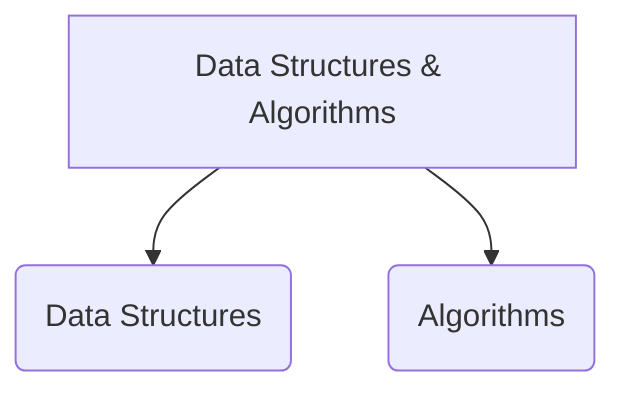
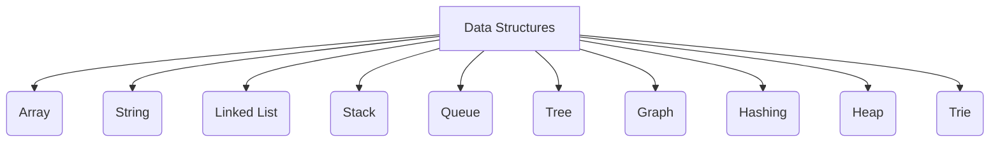
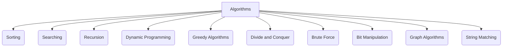

> Data Structures and Algorithms are the building blocks of computer science. They are the tools you'll use to build software systems. This section is a collection of resources to help you understand and master Data Structures and Algorithms.

If you're new to Data Structures and Algorithms, start with the [Introduction to Data Structures and Algorithms](/docs/dsa/) guide.

I'd be glad to create a comprehensive response for your Data Structures and Algorithms (DSA) roadmap, incorporating the best aspects of previous suggestions and addressing potential shortcomings:

### Data Structures

Data Structures are the fundamental building blocks used to organize and store data efficiently. Here are some common data structures you should be familiar with:

- **Array**: A collection of elements of the same type stored in contiguous memory locations.
- **String**: A sequence of characters.
- **Linked List**: A linear data structure where elements are not stored in contiguous memory locations.
- **Stack**: A linear data structure that follows the Last In First Out (LIFO) principle.
- **Queue**: A linear data structure that follows the First In First Out (FIFO) principle.
- **Tree**: A non-linear data structure used to store data hierarchically.
- **Graph**: A non-linear data structure consisting of vertices and edges.
- **Hashing**: A technique used to uniquely identify objects.
- **Heap**: A complete binary tree that satisfies the heap property.
- **Trie**: A tree-like data structure used to store a dynamic set of strings.

### Algorithms

Algorithms are step-by-step procedures used to solve problems or perform computations. Here are some common algorithms you should be familiar with:

- **Sorting**: Arranging elements in a specific order.
- **Searching**: Finding a specific element in a collection of elements.
- **Recursion**: A technique where a function calls itself to solve a smaller instance of the same problem.
- **Dynamic Programming**: Solving problems by breaking them down into smaller subproblems.
- **Greedy Algorithms**: Making locally optimal choices at each step.
- **Divide and Conquer**: Solving problems by breaking them down into smaller subproblems.
- **Brute Force**: Solving problems by trying all possible solutions.
- **Bit Manipulation**: Algorithmically manipulating bits or binary digits.
- **Graph Algorithms**: Solving problems on graphs.
- **String Matching**: Finding a substring within a string.

## Resources

When it comes to learning Data Structures and Algorithms, there are numerous resources available, including books, courses, websites, blogs, YouTube channels, podcasts, Interview Preparation, Competitive Programming, Practice Problems, Mock Interviews, Interview Experiences, Interview Questions, Interview Tips, Interview Cheat Sheets and Interview Preparation Misc.

**Here are some of the most popular and highly recommended resources for mastering DSA:**

### Books

| Book Title | Description | Link (if available) |
|:---|:---|:---|
| Introduction to Algorithms (Cormen et al.) | The classic, in-depth guide to algorithms, covering a wide range of topics and complexities. | [mitpress.mit.edu](http://mitpress.mit.edu/9780262046305/introduction-to-algorithms/) |
| Grokking Algorithms (Bhargava) | A more approachable introduction with clear explanations and visualizations. | [edu.anarcho-copy.org](https://edu.anarcho-copy.org/Algorithm/grokking-algorithms-illustrated-programmers-curious.pdf) |
| Cracking the Coding Interview (Gallott) | A practical guide geared towards interview preparation, with problem-solving strategies and solutions. | [amazon.com](https://www.amazon.com/Design-Patterns-Object-Oriented-Addison-Wesley-Professional-ebook/dp/B000SEIBB8) |
| Elements of Programming Interviews in Python/Java/C++ (Langdon) | Language-specific resources that delve into commonly asked interview questions and solutions. | [amazon.com](https://www.amazon.com/Elements-Programming-Interviews-Python-Insiders/dp/1537713949) |

### Courses

| Platform | Course Title | Description | Link (if available) |
|:---|:---|:---|:---|
| Coursera | Algorithms, Part 1 & 2 (Stanford University) | A well-structured series by Stanford professors, covering fundamental algorithms and data structures. | [coursera.org](https://www.coursera.org/specializations/algorithms) |
| edX | Introduction to Algorithms (MIT) | Another excellent series from MIT, offering a comprehensive exploration of algorithms and complexities. | [edx.org/learn/algorithms](https://www.edx.org/learn/algorithms) |
| Udacity | Nanodegree Programs (Various) | Comprehensive programs focused on specific aspects of DSA, like data structures and algorithms or interview preparation. | [udacity.com](https://www.udacity.com/) |
| Udemy | Various DSA Courses | A vast selection of courses from different instructors, catering to beginner, intermediate, and advanced learners. | [udemy.com](https://www.udemy.com/) |

### Websites

| Website | Description | Link |
|:---|:---|:---|
| GeeksforGeeks | A popular resource with tutorials, practice problems, interview preparation materials, and competitive programming insights. | [geeksforgeeks.org](https://www.geeksforgeeks.org/) |
| LeetCode | A platform with a large collection of coding problems, categorized by difficulty level, company tags, and problem types. | [leetcode.com](https://leetcode.com/) |
| HackerRank | Similar to LeetCode, HackerRank provides coding challenges, practice problems, and interview preparation features. | [hackerrank.com](https://www.hackerrank.com/) |
| Programiz | A website offering clear explanations, visualizations, and interactive coding exercises for various DSA concepts. | [programiz.com](https://www.programiz.com/) |

### Blogs

| Blog | Description | Link (if available) |
|:---|:---|:---|
| InterviewCake | Articles and videos focused on interview preparation, problem-solving strategies, and common DSA topics. | [interviewcake.com](https://www.interviewcake.com/) |
| AlgoExpert | A blog with in-depth articles on algorithms, data structures, and system design, along with video explanations. | [algoexpert.io/product](https://www.algoexpert.io/product) |
| Back to Back SWE | A blog by a former Facebook engineer, offering insights into the tech interview process and practical DSA tips. | [youtube.com/c/BackToBackSWE](https://www.youtube.com/c/BackToBackSWE) |
| MIT OpenCourseware | Access written materials from MIT's renowned algorithms courses, including problem sets and solutions. | [ocw.mit.edu](https://ocw.mit.edu/courses/mathematics/) |

### YouTube Channels

| Channel | Description | Link (if available) |
|:---|:---|:---|
| freeCodeCamp.org | Offers tutorials, problem-solving walkthroughs, and interview preparation advice on DSA concepts. | [youtube.com/c/...](https://www.youtube.com/c/Freecodecamp) |
| The Coding Train | Creates engaging and creative videos that explain data structures and algorithms in a visually appealing way. | [youtube.com/c/...](https://www.youtube.com/channel/UCvjgXvBlbQiydffZU7m1_aw) |
| Computer Science Dojo | Another channel with clear explanations and helpful visualizations for core DSA concepts. | [youtube.com/c/...](https://m.youtube.com/c/CSDojo) |

### Podcasts

| Podcast | Description | Link (if available) |
|:---|:---|:---|
| Software Engineering Daily | Interviews with software engineers, often covering DSA topics and interview experiences. | [softwareengineeringdaily.com](https://softwareengineeringdaily.com/) |
| Coding Blocks | A podcast geared towards Indian students, offering guidance on technical interviews and DSA preparation. | [codingblocks.com](https://www.codingblocks.net/) |

### Interview Preparation

| Resource | Description | Link (if available) |
|:---|:---|:---|
| Pramp | A platform for conducting mock interviews with other programmers, providing valuable practice. | [pramp.com](https://www.pramp.com/) |
| Exponent | Connects you with experienced software engineers for mock interviews and personalized feedback. | N/A |
| Interviewing.io | Similar to Exponent, Interviewing.io allows you to connect with experienced engineers for mock interviews. | [interviewing.io](https://www.interviewing.io/) |
| Blind | An anonymous forum where users share interview experiences and insights from various companies. | N/A |

### Competitive Programming

| Platform | Description | Link (if available) |
|:---|:---|:---|
| LeetCode Contests | Regularly held coding challenges on LeetCode, promoting problem-solving skills and competitive spirit. | [https://leetcode.com/contest/](https://leetcode.com/contest/) |
| HackerRank Contests | Similar to LeetCode Contests, HackerRank offers regular challenges for competitive programmers. | [https://www.hackerrank.com/contests](https://www.hackerrank.com/contests) |
| Codeforces | A popular platform for competitive programming with contests, problems, and tutorials. | [https://codeforces.com/](https://codeforces.com/) |
| Topcoder | Another platform hosting coding challenges, marathons, and tutorials for competitive programmers. | [https://www.topcoder.com/](https://www.topcoder.com/) |

### Practice Problems

| Platform | Description | Link (if available) |
|:---|:---|:---|
| (See Websites section) | Websites like GeeksforGeeks, LeetCode, and HackerRank offer a vast collection of practice problems with varying difficulty levels. | [GFG](https://www.geeksforgeeks.org/), [LeetCode](https://leetcode.com/), [HackerRank](https://www.hackerrank.com/), [W3Schools](https://www.w3schools.com/), [Programiz](https://www.programiz.com/) |
| Project Euler | A website with a series of challenging mathematical and computational problems. | [projecteuler.net](https://projecteuler.net/) |
| HackerRank 100 Days of Code | A structured challenge from HackerRank with daily programming exercises, including DSA problems. | [hackerrank.com/100-days-of-code](https://www.hackerrank.com/100-days-of-code) |

### Mock Interviews

| Resource | Description (mentioned previously) | Link (if available) |
|:---|:---|:---|
| Pramp | Connect with other programmers for mock interviews. | [pramp.com](https://www.pramp.com/) |
| Exponent | Get mock interviews and feedback from experienced engineers. | N/A |
| Interviewing.io | Conduct mock interviews with experienced engineers. | [interviewing.io](https://www.interviewing.io/) |

### Interview Experiences

| Platform | Description (mentioned previously) | Link (if available) |
|:---|:---|:---|
| Blind | Share and read interview experiences from various companies. | N/A |
| LeetCode Discuss | The LeetCode discussion forum often includes threads where users share interview experiences. | [leetcode.com/discuss/](https://leetcode.com/discuss/) |
| Glassdoor | Read interview reviews and experiences for various companies. | [glassdoor.com](https://www.glassdoor.com/) |

### Interview Questions

| Platform | Description (mentioned previously) | Link (if available) |
|:---|:---|:---|
| (See Websites section) | Websites like GeeksforGeeks, LeetCode, and HackerRank provide categorized interview questions. | [GFG](https://www.geeksforgeeks.org/), [LeetCode](https://leetcode.com/), [HackerRank](https://www.hackerrank.com/), [W3Schools](https://www.w3schools.com/), [Programiz](https://www.programiz.com/) |
| Interview Cake | Articles and tutorials focusing on common interview questions and problem-solving techniques. | [interviewcake.com](https://www.interviewcake.com/) |
| AlgoExpert | Offers in-depth explanations of frequently asked interview questions. | [algoexpert.io](https://www.algoexpert.io/product) |

### Interview Tips

| Resource | Description | Link (if available) |
|:---|:---|:---|
| Interview Cake | Articles with practical tips on communication, problem-solving, and approaching technical interviews. | [interviewcake.com](https://www.interviewcake.com/) |
| Pramp | Mock interviews provide valuable experience in handling interview pressure and communication. | [pramp.com](https://www.pramp.com/) |
| Exponent | Feedback from experienced engineers can help identify areas for improvement in your interview approach. | N/A |
| Interviewing.io | Mock interviews allow you to practice your communication skills and technical problem-solving under interview-like conditions. | [interviewing.io](https://www.interviewing.io/) |
| Blogs (mentioned previously) | Blogs like InterviewCake and Back to Back SWE offer valuable advice on interview preparation and communication. | N/A |

### Interview Cheat Sheets

| Resource | Description | Link (if available) |
|:---|:---|:---|
| Tech Interview Handbook | A comprehensive online guide with cheat sheets for various DSA topics, big O notation, and system design. | [techinterviewhandbook.org](https://www.techinterviewhandbook.org/) |
| AlgoExpert | Cheat sheets summarizing key concepts and problem-solving approaches for common interview questions. | [algoexpert.io](https://www.algoexpert.io/product) |
| LeetCode Cheat Sheet | A community-created cheat sheet with summaries of various DSA concepts and algorithms. | [leetcode.com](https://leetcode.com/explore/interview/card/cheatsheets/) |

### Interview Preparation Misc

| Resource | Description | Link (if available) |
|:---|:---|:---|
| LeetCode Blind Questions | A curated list of interview questions frequently asked at top tech companies, based on user reports on Blind. | [https://leetcode.com/discuss/](https://leetcode.com/discuss/general-discussion/460599/blind-75-leetcode-questions) |
| System Design Interview | A website dedicated to system design interview preparation, offering resources and practice problems. | N/A |
| Educative.io | Offers interactive courses and practice problems for DSA, system design, and interview preparation. | [https://www.educative.io/](https://www.educative.io/) |

Remember, this roadmap is a starting point. Tailor it to your specific learning style, goals, and the types of roles you're targeting. Be consistent in your practice, and don't hesitate to seek help from online communities or mentors when needed.

***Good luck on your journey to mastering Data Structures and Algorithms!***