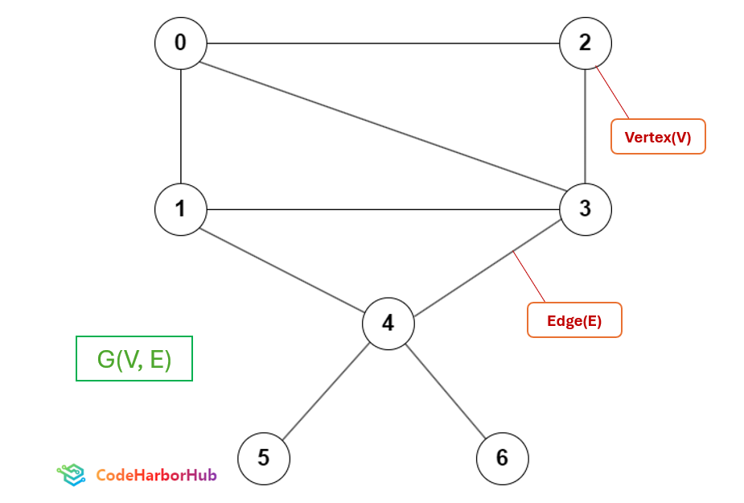

## What is Graph Data Structure
Graph Data Structure is a collection of vertices connected by edges. The vertices(V) are also referred as nodes and lines connecting any two nodes are called edges(E). A graph is denoted by G(V,E).


## Traversal Methods in Graph
Two very popular traversal methods in Graph are:
* BFS (Breadth First Search)
* DFS (Depth First Search)

## BFS (Breadth First Search)
Breadth First Search traversal algorithm in graph is similar to level order traversal of tree.  It starts at a specified vertex and visits all its neighbors before moving on to the next level of neighbors. BFS is commonly used in algorithms for pathfinding, connected components, and shortest path problems in graphs.
### Algorithm:
1. Use adjacency list or adjacency matrix to store the graph, queue and a visiting array to keep the track of the visited vertex.
2. Strat traversal from any vertex.
3. Drop that vertex into queue
4. Take out the vertex from queue and explore it.
5. While exploring, go to all the adjacent vertices and add them to queue.
6. Repeat step 4 and 5 unitl queue is not empty. 

### BFS Program
<Tabs>
  <TabItem value="C++" label="C++">
    ```Cpp  showLineNumbers
    /*write a cpp program to implement bfs algorithm*/
#include<iostream>
#include<queue>
#include<vector>
using namespace std;
void bfs(int source, vector<vector<int>>&graph,int vertex)
{
    queue<int>qu;
    vector<int>visited(vertex,0);
    qu.push(source);
    visited[source]=1;
    cout<<source<<" ";
    while(!qu.empty())
    {
        int u=qu.front();
        qu.pop();
        for(auto it: graph[u])
        {
            if (visited[it]==0)
            {
                cout<<it<<" ";
                visited[it]=1;
                qu.push(it);
            }
        }
    }

}
int main()
{
    int vertex=7;
    vector<vector<int>>adjlis(vertex); //using adjacent list method to represent graph
    //there are 9 edges in the graph
    adjlis[0].push_back(2);
    adjlis[0].push_back(1);
    adjlis[0].push_back(3);
    adjlis[1].push_back(3);
    adjlis[2].push_back(3);
    adjlis[2].push_back(4);
    adjlis[3].push_back(4);
    adjlis[4].push_back(5);
    adjlis[4].push_back(6);
    
    bfs(0,adjlis,vertex);
    return 0;
}
    ```
  </TabItem>

  <TabItem value="Python" label="Python">
  ```Python showLineNumbers
  from collections import deque
  def bfs(source, graph, vertex):
      qu = deque()
      visited = [0] * vertex
      qu.append(source)
      visited[source] = 1
      print(source, end=" ")

      while qu:
          u = qu.popleft()
          for it in graph[u]:
              if visited[it] == 0:
                  print(it, end=" ")
                  visited[it] = 1
                  qu.append(it)

  def main():
      vertex = 7
      adjlis = [[] for _ in range(vertex)]  # using adjacency list method to represent graph
      # there are 9 edges in the graph
      adjlis[0].extend([2, 1, 3])
      adjlis[1].append(3)
      adjlis[2].extend([3, 4])
      adjlis[3].append(4)
      adjlis[4].extend([5, 6])
      
      bfs(0, adjlis, vertex)

  if __name__ == "__main__":
      main()

  ```
  </TabItem>

  <TabItem value="Java" label="Java">
```jsx showLineNumbers
import java.util.*;

public class Main {
    public static void bfs(int source, List<List<Integer>> graph, int vertex) {
        Queue<Integer> qu = new LinkedList<>();
        boolean[] visited = new boolean[vertex];
        qu.add(source);
        visited[source] = true;
        System.out.print(source + " ");

        while (!qu.isEmpty()) {
            int u = qu.poll();
            for (int it : graph.get(u)) {
                if (!visited[it]) {
                    System.out.print(it + " ");
                    visited[it] = true;
                    qu.add(it);
                }
            }
        }
    }

    public static void main(String[] args) {
        int vertex = 7;
        List<List<Integer>> adjlis = new ArrayList<>(vertex);
        
        for (int i = 0; i < vertex; i++) {
            adjlis.add(new ArrayList<>());
        }

        // There are 9 edges in the graph
        adjlis.get(0).addAll(Arrays.asList(2, 1, 3));
        adjlis.get(1).add(3);
        adjlis.get(2).addAll(Arrays.asList(3, 4));
        adjlis.get(3).add(4);
        adjlis.get(4).addAll(Arrays.asList(5, 6));

        bfs(0, adjlis, vertex);
    }
}

```
</TabItem>

<TabItem value="JavaScript" label="JavaScript">
```JavaScript showLineNumbers
class Graph {
    constructor(vertex) {
        this.vertex = vertex;
        this.adjList = new Array(vertex).fill(null).map(() => []);
    }

    addEdge(src, dest) {
        this.adjList[src].push(dest);
    }

    bfs(source) {
        const visited = new Array(this.vertex).fill(false);
        const queue = [];
        visited[source] = true;
        queue.push(source);

        while (queue.length !== 0) {
            const u = queue.shift();
            console.log(u);

            for (const it of this.adjList[u]) {
                if (!visited[it]) {
                    visited[it] = true;
                    queue.push(it);
                }
            }
        }
    }
}

const main = () => {
    const vertex = 7;
    const graph = new Graph(vertex);

    // There are 9 edges in the graph
    graph.addEdge(0, 2);
    graph.addEdge(0, 1);
    graph.addEdge(0, 3);
    graph.addEdge(1, 3);
    graph.addEdge(2, 3);
    graph.addEdge(2, 4);
    graph.addEdge(3, 4);
    graph.addEdge(4, 5);
    graph.addEdge(4, 6);

    graph.bfs(0);
};

main();
```
</TabItem>
</Tabs>
Output:<br />

```
0 2 1 3 4 5 6 
```

## DFS (Depth First Search)
Depth First Search traversal algorithm is similar to Pre-order traversal in binary tree. DFS use stack data structure here (or recursion as stack).he algorithm starts at the root node (selecting some arbitrary node as the root node in the case of a graph) and explores as far as possible along each branch before backtracking.

### Algorithm:
1. Use adjacency list or adjacency matrix to store the graph, queue and a visiting array to keep the track of the visited vertex.
2. Start with any vertex and start exploring.
3. After getting first element suspend the previous one in the stack and now start exploring this vertex.
4. If cannot explore more go back to previous vertex (backtraking) from stack and explore that
5. Repeat 3 and 4 until stack is empty.

### DFS Program
<Tabs>
  <TabItem value="C++" label="C++">
    ```Cpp  showLineNumbers
    #include <iostream>
#include <vector>
using namespace std;

// Function for DFS traversal
void DFS(int u,  vector<vector<int>>& G, vector<int>& visited) {
    cout << u << " ";
    visited[u] = 1;
    
    for (int v = 0; v < G.size(); ++v) {
        if (G[u][v] == 1 && visited[v] == 0) {
            DFS(v, G, visited);
        }
    }
}

int main() {
    int vertex=7;
    
    //using adjacent matrix method to represent graph
    vector<vector<int>> G{{0,1,1,1,0,0,0},
                            {1,0,0,1,1,0,0},
                            {1,0,0,1,0,0,0},
                            {1,1,1,0,1,0,0},
                            {0,1,0,1,0,1,1},
                            {0,0,0,0,1,0,0},
                            {0,0,0,0,1,0,0}};
   

    vector<int> visited(vertex, 0); // Initialize visited array to 0

    cout << "DFS traversal starting from vertex 0: ";
    DFS(0, G, visited);
    
    return 0;
}
    ```
  </TabItem>

  <TabItem value="Python" label="Python">
    ```Python  showLineNumbers
   def dfs(u, graph, visited):
    print(u, end=" ")
    visited[u] = 1

    for v in range(len(graph)):
        if graph[u][v] == 1 and not visited[v]:
            dfs(v, graph, visited)

def main():
    vertex = 7

    graph = [
        [0, 1, 1, 1, 0, 0, 0],
        [1, 0, 0, 1, 1, 0, 0],
        [1, 0, 0, 1, 0, 0, 0],
        [1, 1, 1, 0, 1, 0, 0],
        [0, 1, 0, 1, 0, 1, 1],
        [0, 0, 0, 0, 1, 0, 0],
        [0, 0, 0, 0, 1, 0, 0]
    ]

    visited = [0] * vertex  # Initialize visited array to 0

    print("DFS traversal starting from vertex 0: ", end="")
    dfs(0, graph, visited)

if __name__ == "__main__":
    main()

    ```
  </TabItem>

  <TabItem value="Java" label="Java">
    ```jsx  showLineNumbers
    import java.util.*;

public class DFS {
    // Function for DFS traversal
    public static void dfs(int u, int[][] graph, boolean[] visited) {
        System.out.print(u + " ");
        visited[u] = true;

        for (int v = 0; v < graph.length; v++) {
            if (graph[u][v] == 1 && !visited[v]) {
                dfs(v, graph, visited);
            }
        }
    }

    public static void main(String[] args) {
        int vertex = 7;

        int[][] graph = {
            {0, 1, 1, 1, 0, 0, 0},
            {1, 0, 0, 1, 1, 0, 0},
            {1, 0, 0, 1, 0, 0, 0},
            {1, 1, 1, 0, 1, 0, 0},
            {0, 1, 0, 1, 0, 1, 1},
            {0, 0, 0, 0, 1, 0, 0},
            {0, 0, 0, 0, 1, 0, 0}
        };

        boolean[] visited = new boolean[vertex]; // Initialize visited array to false

        System.out.print("DFS traversal starting from vertex 0: ");
        dfs(0, graph, visited);
    }
}

    ```
  </TabItem>

  <TabItem value="JavaScript" label="JavaScript">
    ```JavaScript  showLineNumbers
    class Graph {
    constructor(vertex) {
        this.vertex = vertex;
        this.adjList = new Array(vertex).fill(null).map(() => []);
    }

    addEdge(src, dest) {
        this.adjList[src].push(dest);
    }

    dfsUtil(v, visited) {
        visited[v] = true;
        console.log(v + " ");

        this.adjList[v].forEach(neighbour => {
            if (!visited[neighbour]) {
                this.dfsUtil(neighbour, visited);
            }
        });
    }

    dfs(v) {
        let visited = new Array(this.vertex).fill(false);
        this.dfsUtil(v, visited);
    }
}

const main = () => {
    const vertex = 7;
    const graph = new Graph(vertex);

    graph.addEdge(0, 1);
    graph.addEdge(0, 2);
    graph.addEdge(0, 3);
    graph.addEdge(1, 3);
    graph.addEdge(1, 4);
    graph.addEdge(2, 3);
    graph.addEdge(3, 4);
    graph.addEdge(4, 5);
    graph.addEdge(4, 6);

    console.log("DFS traversal starting from vertex 0: ");
    graph.dfs(0);
};

main();

    ```
  </TabItem>
</Tabs>
Output:<br />

```
DFS traversal starting from vertex 0: 0 1 3 2 4 5 6 
```
