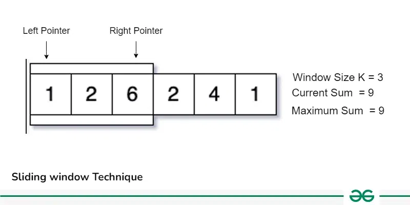
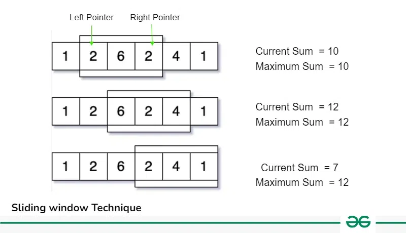
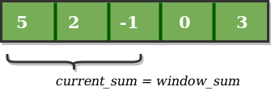
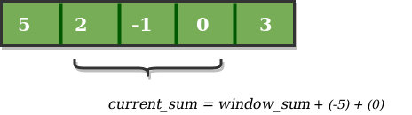
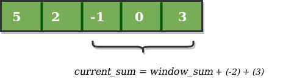

# Sliding Window Technique

Sliding Window problems are problems in which a fixed or variable-size window is moved through a data structure, typically an array or string, to solve problems efficiently based on continuous subsets of elements. This technique is used when we need to find subarrays or substrings according to a given set of conditions.

## What is Sliding Window Technique?

```
Sliding Window Technique is a method used to efficiently solve problems that involve defining a window or range in the input data (arrays or strings) and then moving that window across the data to perform some operation within the window. This technique is commonly used in algorithms like finding subarrays with a specific sum, finding the longest substring with unique characters, or solving problems that require a fixed-size window to process elements efficiently.
```

Let’s take an example to understand this properly, say we have an array of size N and also an integer K. Now, we have to calculate the maximum sum of a subarray having size exactly K. Now how should we approach this problem?

One way to do this by taking each subarray of size K from the array and find out the maximum sum of these subarrays. This can be done using Nested loops which will result into &O(N2)& Time Complexity.

### But can we optimize this approach?

The answer is Yes, instead of taking each K sized subarray and calculating its sum, we can just take one K size subarray from 0 to K-1 index and calculate its sum now shift our range one by one along with the iterations and update the result, like in next iteration increase the left and right pointer and update the previous sum as shown in the below image:

          

Now follow this method for each iteration till we reach the end of the array:

          

So, we can see that instead of recalculating the sum of each K sized subarray we are using previous window of size K and using its results we update the sum and shift the window right by moving left and right pointers, this operation is optimal because it take O(1) time to shift the range instead of recalculating.

This approach of shifting the pointers and calculating the results accordingly is known as Sliding window Technique.

## How to use Sliding Window Technique?

There are basically two types of sliding window:

#### 1. Fixed Size Sliding Window:

    The general steps to solve these questions by following below steps:

           a) Find the size of the window required, say K.

           b) Compute the result for 1st window, i.e. include the first K elements of the data structure.

           c) Then use a loop to slide the window by 1 and keep computing the result window by window.

#### 2. Variable Size Sliding Window:

    The general steps to solve these questions by following below steps:

           a) In this type of sliding window problem, we increase our right pointer one by one till our condition is true.

           b) At any step if our condition does not match, we shrink the size of our window by increasing left pointer.

           c) Again, when our condition satisfies, we start increasing the right pointer and follow step 1.
            We follow these steps until we reach to the end of the array.

## How to Identify Sliding Window Problems:

1.  These problems generally require Finding Maximum/Minimum Subarray, Substrings which satisfy some specific condition.

2.  The size of the subarray or substring ‘K’ will be given in some of the problems.

3.  These problems can easily be solved in $O(N2)$ time complexity using nested loops, using sliding window we can solve these in $O(n)$ Time Complexity.

4.  Required Time Complexity: $O(N)$ or $O(Nlog(N))$

5.  Constraints: N `<=` 106 , If N is the size of the Array/String.

## Use Cases of Sliding Window Technique:

### Question 1

1. To find the maximum sum of all subarrays of size K:

Given an array of integers of size ‘n’, Our aim is to calculate the maximum sum of ‘k’ consecutive elements in the array.

```
Input  : arr[] = {100, 200, 300, 400}, k = 2
Output : 700

Input  : arr[] = {1, 4, 2, 10, 23, 3, 1, 0, 20}, k = 4
Output : 39
We get maximum sum by adding subarray {4, 2, 10, 23} of size 4.

Input  : arr[] = {2, 3}, k = 3
Output : Invalid
There is no subarray of size 3 as size of whole array is 2.
```

### Naïve Approach:

So, let’s analyze the problem with Brute Force Approach. We start with the first index and sum till the kth element. We do it for all possible consecutive blocks or groups of k elements. This method requires a nested for loop, the outer for loop starts with the starting element of the block of k elements, and the inner or the nested loop will add up till the kth element.

Below is the implementation of the above approach:

<Tabs>
    <TabItem value="cpp" label="C++" default>
      <SolutionAuthor name="@Ajay-Dhangar"/>
      ```cpp
      #include <iostream>
      #include <climits>
      using namespace std;

      // Returns maximum sum in a subarray of size k.
      int maxSum(int arr[], int n, int k) {
          // Initialize result
          int max_sum = INT_MIN;

          // Consider all blocks starting with i.
          for (int i = 0; i < n - k + 1; i++) {
              int current_sum = 0;
              for (int j = 0; j < k; j++)
                  current_sum = current_sum + arr[i + j];

              // Update result if required.
              max_sum = max(current_sum, max_sum);
          }

          return max_sum;
      }

      // Driver code
      int main() {
          int arr[] = { 1, 4, 2, 10, 2, 3, 1, 0, 20 };
          int k = 4;
          int n = sizeof(arr) / sizeof(arr[0]);
          cout << maxSum(arr, n, k);
          return 0;
      }
      ```
    </TabItem>
    <TabItem value="java" label="Java">
      <SolutionAuthor name="@Ajay-Dhangar"/>
      ```java
      import java.util.*;

      public class Main {
          // Returns maximum sum in a subarray of size k.
          public static int maxSum(int[] arr, int n, int k) {
              // Initialize result
              int max_sum = Integer.MIN_VALUE;

              // Consider all blocks starting with i.
              for (int i = 0; i < n - k + 1; i++) {
                  int current_sum = 0;
                  for (int j = 0; j < k; j++)
                      current_sum = current_sum + arr[i + j];

                  // Update result if required.
                  max_sum = Math.max(current_sum, max_sum);
              }

              return max_sum;
          }

          // Driver code
          public static void main(String[] args) {
              int[] arr = { 1, 4, 2, 10, 2, 3, 1, 0, 20 };
              int k = 4;
              int n = arr.length;
              System.out.println(maxSum(arr, n, k));
          }
      }
      ```
    </TabItem>
    <TabItem value="python" label="Python">
      <SolutionAuthor name="@Ajay-Dhangar"/>
      ```python
      # Returns maximum sum in a subarray of size k.
      def maxSum(arr, n, k):
          # Initialize result
          max_sum = float('-inf')

          # Consider all blocks starting with i.
          for i in range(n - k + 1):
              current_sum = 0
              for j in range(k):
                  current_sum += arr[i + j]

              # Update result if required.
              max_sum = max(current_sum, max_sum)

          return max_sum

      # Driver code
      arr = [1, 4, 2, 10, 2, 3, 1, 0, 20]
      k = 4
      n = len(arr)
      print(maxSum(arr, n, k))
      ```
    </TabItem>
    <TabItem value="c" label="C">
      <SolutionAuthor name="@Ajay-Dhangar"/>
      ```c
      #include <stdio.h>
      #include <limits.h>

      // Returns maximum sum in a subarray of size k.
      int maxSum(int arr[], int n, int k) {
          // Initialize result
          int max_sum = INT_MIN;

          // Consider all blocks starting with i.
          for (int i = 0; i < n - k + 1; i++) {
              int current_sum = 0;
              for (int j = 0; j < k; j++)
                  current_sum = current_sum + arr[i + j];

              // Update result if required.
              if (current_sum > max_sum) {
                  max_sum = current_sum;
              }
          }

          return max_sum;
      }

      // Driver code
      int main() {
          int arr[] = { 1, 4, 2, 10, 2, 3, 1, 0, 20 };
          int k = 4;
          int n = sizeof(arr) / sizeof(arr[0]);
          printf("%d\n", maxSum(arr, n, k));
          return 0;
      }
      ```
    </TabItem>

</Tabs>

Output:

```
24
```

Time complexity: $O(k*n)$ as it contains two nested loops.
Auxiliary Space: $O(1)$

### Applying the sliding window technique:

       1. We compute the sum of the first k elements out of n terms using a linear loop and store the sum in variable window_sum.

       2. Then we will traverse linearly over the array till it reaches the end and simultaneously keep track of the maximum sum.

       3. To get the current sum of a block of k elements just subtract the first element from the previous block and add the last element of the current block.

The below representation will make it clear how the window slides over the array.

```
Consider an array arr[] = {5, 2, -1, 0, 3} and value of k = 3 and n = 5

This is the initial phase where we have calculated the initial window sum starting from index 0 . At this stage the window sum is 6. Now, we set the maximum_sum as current_window i.e 6.

          

Now, we slide our window by a unit index. Therefore, now it discards 5 from the window and adds 0 to the window. Hence, we will get our new window sum by subtracting 5 and then adding 0 to it. So, our window sum now becomes 1. Now, we will compare this window sum with the maximum_sum. As it is smaller, we won’t change the maximum_sum.

          

Similarly, now once again we slide our window by a unit index and obtain the new window sum to be 2. Again we check if this current window sum is greater than the maximum_sum till now. Once, again it is smaller so we don’t change the maximum_sum.
Therefore, for the above array our maximum_sum is 6.

           


```

Below is the code for above approach:

<Tabs>
    <TabItem value="cpp" label="C++" default>
      <SolutionAuthor name="@Ajay-Dhangar"/>
      ```cpp
      #include <iostream>
      using namespace std;

      int maxSum(int arr[], int n, int k) {
          // n must be greater
          if (n <= k) {
              cout << "Invalid";
              return -1;
          }

          // Compute sum of first window of size k
          int max_sum = 0;
          for (int i = 0; i < k; i++)
              max_sum += arr[i];

          // Compute sums of remaining windows by
          // removing first element of previous
          // window and adding last element of
          // current window.
          int window_sum = max_sum;
          for (int i = k; i < n; i++) {
              window_sum += arr[i] - arr[i - k];
              max_sum = max(max_sum, window_sum);
          }

          return max_sum;
      }

      // Driver code
      int main() {
          int arr[] = { 1, 4, 2, 10, 2, 3, 1, 0, 20 };
          int k = 4;
          int n = sizeof(arr) / sizeof(arr[0]);
          cout << maxSum(arr, n, k);
          return 0;
      }
      ```
    </TabItem>
    <TabItem value="java" label="Java">
      <SolutionAuthor name="@Ajay-Dhangar"/>
      ```java
      import java.util.*;

      public class Main {
          public static int maxSum(int[] arr, int n, int k) {
              // n must be greater
              if (n <= k) {
                  System.out.println("Invalid");
                  return -1;
              }

              // Compute sum of first window of size k
              int max_sum = 0;
              for (int i = 0; i < k; i++)
                  max_sum += arr[i];

              // Compute sums of remaining windows by
              // removing first element of previous
              // window and adding last element of
              // current window.
              int window_sum = max_sum;
              for (int i = k; i < n; i++) {
                  window_sum += arr[i] - arr[i - k];
                  max_sum = Math.max(max_sum, window_sum);
              }

              return max_sum;
          }

          // Driver code
          public static void main(String[] args) {
              int[] arr = { 1, 4, 2, 10, 2, 3, 1, 0, 20 };
              int k = 4;
              int n = arr.length;
              System.out.println(maxSum(arr, n, k));
          }
      }
      ```
    </TabItem>
    <TabItem value="python" label="Python">
      <SolutionAuthor name="@Ajay-Dhangar"/>
      ```python
      def maxSum(arr, n, k):
          # n must be greater
          if n <= k:
              print("Invalid")
              return -1

          # Compute sum of first window of size k
          max_sum = sum(arr[:k])

          # Compute sums of remaining windows by
          # removing first element of previous
          # window and adding last element of
          # current window.
          window_sum = max_sum
          for i in range(k, n):
              window_sum += arr[i] - arr[i - k]
              max_sum = max(max_sum, window_sum)

          return max_sum

      # Driver code
      arr = [1, 4, 2, 10, 2, 3, 1, 0, 20]
      k = 4
      n = len(arr)
      print(maxSum(arr, n, k))
      ```
    </TabItem>
    <TabItem value="c" label="C">
      <SolutionAuthor name="@Ajay-Dhangar"/>
      ```c
      #include <stdio.h>
      #include <limits.h>

      int maxSum(int arr[], int n, int k) {
          // n must be greater
          if (n <= k) {
              printf("Invalid");
              return -1;
          }

          // Compute sum of first window of size k
          int max_sum = 0;
          for (int i = 0; i < k; i++)
              max_sum += arr[i];

          // Compute sums of remaining windows by
          // removing first element of previous
          // window and adding last element of
          // current window.
          int window_sum = max_sum;
          for (int i = k; i < n; i++) {
              window_sum += arr[i] - arr[i - k];
              if (window_sum > max_sum)
                  max_sum = window_sum;
          }

          return max_sum;
      }

      // Driver code
      int main() {
          int arr[] = { 1, 4, 2, 10, 2, 3, 1, 0, 20 };
          int k = 4;
          int n = sizeof(arr) / sizeof(arr[0]);
          printf("%d\n", maxSum(arr, n, k));
          return 0;
      }
      ```
    </TabItem>

</Tabs>

Time Complexity: $O(n)$, where n is the size of input array arr[].
Auxiliary Space: $O(1)$

### Question 2:

2. Smallest subarray with sum greater than a given value:

Given an array arr[] of integers and a number X, the task is to find the smallest subarray with a sum greater than the given value.

Approach:

```
We can solve this problem using Sliding Window Technique and maintaining two pointers: start and end to mark the starting and ending of the window. We can keep incrementing the end pointer till the sum of the window is less than or equal to X. When, the sum of window becomes greater than X, we record the length of the window and start moving the start pointer till the sum of window becomes smaller than or equal to X. Now, when the sum becomes smaller than or equal to X, again start incrementing the end pointer. Keep on moving the start and end pointer till we have reached the end of the array.
```

### Question 3:

3. Find subarray with given sum in an array of non-negative integers:

Given an array arr[] of non-negative integers and an integer sum, find a subarray that adds to a given sum.

Approch:

```
The idea is simple as we know that all the elements in subarray are positive so, If a subarray has sum greater than the given sum then there is no possibility that adding elements to the current subarray will be equal to the given sum. So the Idea is to use a similar approach to a sliding window.

  1. Start with an empty subarray.
  2. add elements to the subarray until the sum is less than x( given sum ).
  3. If the sum is greater than x, remove elements from the start of the current subarray.
```

### Question 4:

4. Smallest window that contains all characters of string itself:

```
Basically a window of characters is maintained by using two pointers namely start and end. These start and end pointers can be used to shrink and increase the size of window respectively. Whenever the window contains all characters of given string, the window is shrinked from left side to remove extra characters and then its length is compared with the smallest window found so far.
If in the present window, no more characters can be deleted then we start increasing the size of the window using the end until all the distinct characters present in the string are also there in the window. Finally, find the minimum size of each window.
```
