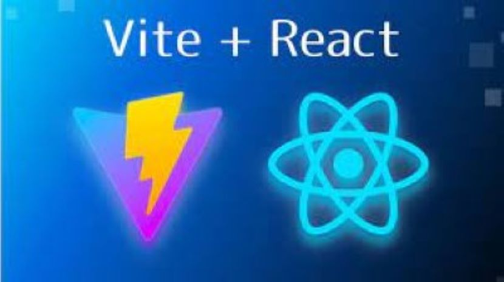

import './style.css';



Vite is a modern build tool that offers faster development times and optimized builds. It aligns with modern web standards and provides out-of-the-box support for TypeScript, making it an excellent choice for React development. In this blog post, we will learn how to get started with React by creating a new app using Vite. We will follow the steps to set up our development environment and build our first React application.

## Quick Start

To get started with Vite, we need to have Node.js installed on our system. We can install Node.js by downloading the installer from the official website or using a package manager. Once we have Node.js installed, we can use npm to create a new Vite project with the React template.

**To quickly get started with Vite and React, follow these steps:**

```bash
npm create vite@latest my-app --template react
```

This command will create a new Vite project called `my-app` using the React template. It will set up the project structure and install the necessary dependencies. We can then navigate to the `my-app` directory and start the development server to see our new React application in action.

**Now navigate to the `my-app` directory:**

```bash
cd my-app
```

**if you prefer using npm:**

```bash
npm install
```

**Or, if you prefer using yarn:**

```bash
yarn
```

**Now start the development server:**

```bash
npm start
```

**Or, if you prefer using yarn:**

```bash
yarn start
```

Once the development server has started, open [http://localhost:3000/](http://localhost:3000/) in your browser to see your new React application. You can start building your React components, defining routes, and managing state using the React Context API.

## Project Structure

The Vite project structure for a new React application is minimal and easy to understand. It provides a clean and organized layout that aligns with modern web development practices. Here is an overview of the project structure:

```plaintext
my-app
├── node_modules
├── public
│   ├── favicon.ico
│   ├── index.html
├── src
│   ├── App.css
│   ├── App.jsx
│   ├── index.css
│   ├── index.jsx
├── .gitignore
├── package.json
├── README.md
```

The `public` directory contains the static assets for our application, such as the `index.html` file and the `favicon.ico` icon. The `src` directory contains the source code for our React application, including the main `index.jsx` file and the `App.jsx` component.

## Building Our First React Application

Now that we have our development environment set up and our project structure in place, we can start building our first React application. We can create new components, define routes, and manage state using the React Context API. We can also use popular libraries such as React Router and React hooks to enhance our application.

To learn more about building React applications with Vite, refer to the official [React documentation](https://reactjs.org/docs/getting-started.html). The documentation provides detailed information on React concepts, best practices, and advanced topics.

## Why Vite?

Vite offers several advantages for React development, including:

- **Faster Development**: Vite provides a lightning-fast development server with hot module replacement (HMR) and instant server start. It eliminates the need for a bundler during development, resulting in faster build times and a smoother development experience.
- **Optimized Builds**: Vite optimizes the production build by leveraging native ES module support in modern browsers. It generates highly optimized and tree-shaken builds, resulting in smaller bundle sizes and improved performance.
- **Modern Web Standards**: Vite aligns with modern web standards and leverages native browser features such as ES modules, dynamic imports, and web workers. It provides an efficient development environment that embraces the latest web technologies.
- **TypeScript Support**: Vite offers out-of-the-box support for TypeScript, enabling us to write type-safe code and leverage advanced TypeScript features. It provides seamless integration with React and TypeScript, making it an excellent choice for React development.
- **Plugin Ecosystem**: Vite has a rich plugin ecosystem that allows us to extend its functionality and customize the build process. We can use plugins to add features such as CSS preprocessing, asset optimization, and code transformation.
- **Developer Experience**: Vite provides an excellent developer experience with features such as instant server start, optimized builds, and real-time feedback. It streamlines the development workflow and enables us to focus on building great React applications.
- **Community Support**: Vite has a growing community and active maintainers who contribute to its development and provide support. It has gained popularity in the React ecosystem and is widely adopted by developers.
- **Migration Path**: Vite offers a smooth migration path for existing React projects by providing a Vite-compatible React template. It allows us to migrate our projects to Vite without significant changes to the codebase.
- **Future Compatibility**: Vite is designed to be future-compatible and aligns with the latest web standards and best practices. It provides a solid foundation for building modern React applications that are ready for the future.
- **Open Source**: Vite is an open-source project with a permissive license that allows us to use, modify, and distribute it freely. It is developed in the open and welcomes contributions from the community.
- **Continuous Improvement**: Vite is continuously improved and updated with new features, optimizations, and bug fixes. It has a roadmap for future releases and aims to provide a cutting-edge development experience for React developers.
- **Integration with Vercel**: Vite has seamless integration with Vercel, a popular platform for deploying web applications. It allows us to deploy our Vite projects to Vercel with minimal configuration and take advantage of Vercel's features such as serverless functions and edge caching.
- **Developer Tools**: Vite provides a set of developer tools that enhance the development experience, including a built-in development server, optimized builds, and real-time feedback. It offers a comprehensive toolkit for building and debugging React applications.
- **Performance Optimization**: Vite optimizes the development and production builds by leveraging modern web standards and best practices. It provides a performant and efficient build process that results in faster load times and improved user experience.
- **Community Plugins**: Vite has a rich ecosystem of community plugins that extend its functionality and provide additional features. We can use plugins to add support for features such as PWA, internationalization, and analytics to our Vite projects.
- **Learning Resources**: Vite has a growing collection of learning resources, tutorials, and documentation that help developers get started with Vite and build great React applications. It provides comprehensive guidance on using Vite effectively and efficiently.
- **Developer Community**: Vite has a vibrant developer community that actively contributes to its development and provides support to fellow developers. It has a dedicated Discord server, GitHub repository, and community forums where developers can connect and collaborate.

:::info 📚 Learn More:
To learn more about Vite, visit the official [Vite documentation](https://vitejs.dev/).
:::

## Conclusion

In this blog post, we learned how to get started with React by creating a new app using Vite. We followed the steps to set up our development environment and build our first React application. We explored the advantages of using Vite for React development and discussed its features, benefits, and community support. We also learned about the project structure of a new React application created with Vite and how to build our first React application. We hope this blog post has provided you with valuable insights into using Vite for React development and has inspired you to explore the possibilities of building modern web applications with Vite and React.