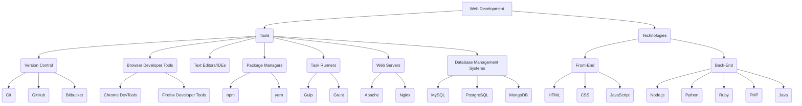
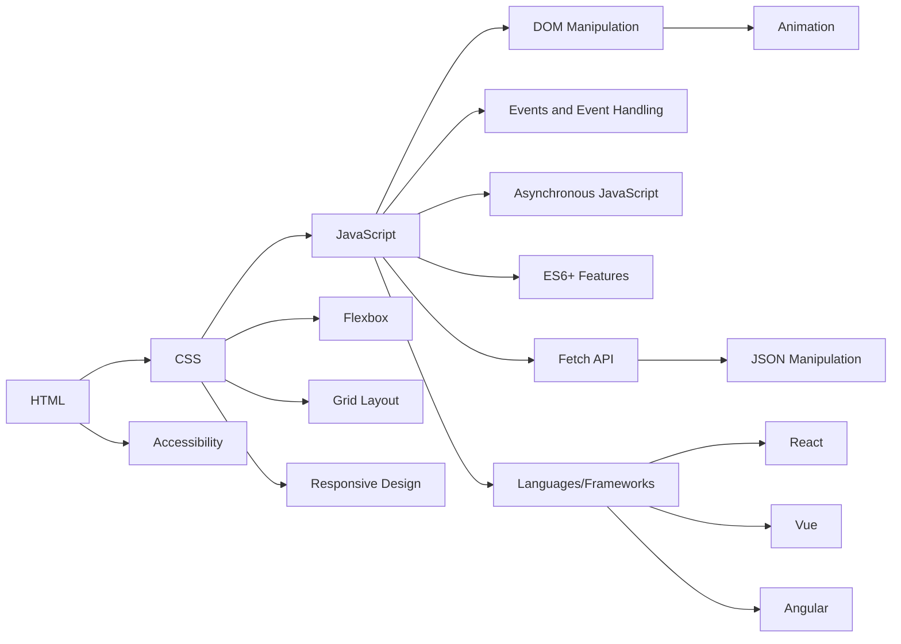
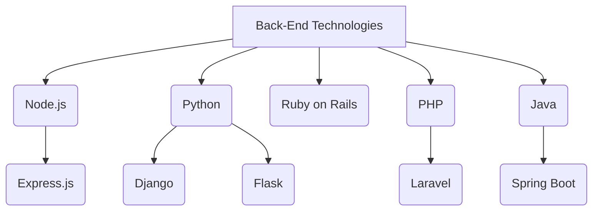
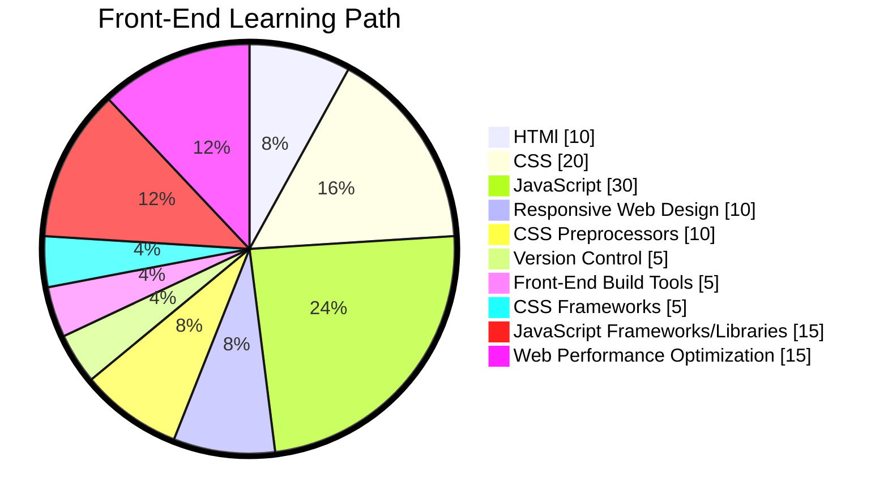
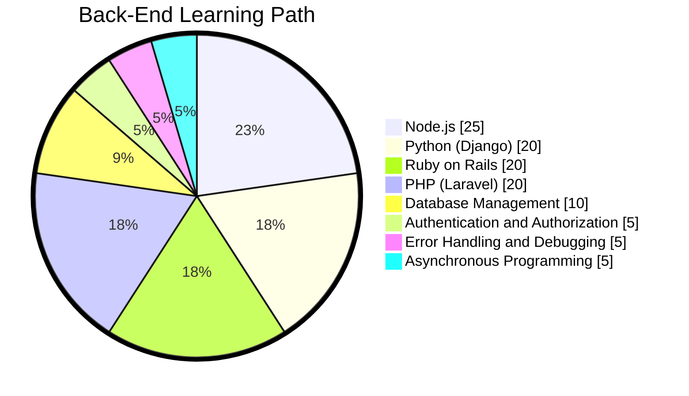

import GiscusComponent from '@site/src/components/GiscusComponent';

> Web development is the work involved in developing a Web site for the Internet (World Wide Web) or an intranet (a private network). Web development can range from developing a simple single static page of plain text to complex Web-based Internet applications (Web apps), electronic businesses, and social network services. A more comprehensive list of tasks to which Web development commonly refers may include Web engineering, Web design, Web content development, client liaison, client-side/server-side scripting, Web server and network security configuration, and e-commerce development. Among Web professionals, "Web development" usually refers to the main non-design aspects of building Web sites: writing markup and coding. Web development may use content management systems (CMS) to make content changes easier and available with basic technical skills.

## Overview of Web Development

Web development has been a growing industry since the commercialization of the web. It encompasses a wide range of topics and skills, including but not limited to creating and maintaining web applications, creating and maintaining websites, and creating and maintaining web services. Web development includes many types of web content creation. Some examples include hand coding web pages in a text editor, building a website in a program like Dreamweaver, and updating a blog via a blogging website. In recent years, content management systems like WordPress, Drupal, and Joomla have also become popular means of web development. These tools make it easy for anyone to create and edit their own website using a web-based interface.

## Introduction to Web Development

Web Development is a broad term for the work involved in developing a web site for the Internet (World Wide Web) or an intranet (a private network). If you want to share your thoughts, ideas, and information with the world, you need a website. And if you want to create a website, you need to learn web development. Web development is the process of building and maintaining a website. It includes aspects such as web design, web publishing, web programming, and database management. While the terms **web developer** and **web designer** are often used synonymously, they do not mean the same thing. Technically, a web designer only designs website interfaces using HTML and CSS. A web developer may be involved in designing a website, but may also write web scripts in languages such as PHP and ASP. Additionally, a web developer may help maintain and update a database used by a dynamic website.

## Web Development Tools

Web development tools have come a long way in just a few short years. Thanks to the rapid advancement of technology, web development tools are no longer limited to text editors. Today, we have a wide range of tools available to help streamline the web development process. These tools are designed to help developers create, debug, and maintain websites and applications. They also help to ensure that the final product is both functional and visually appealing. Some of the most popular web development tools include:

### Text Editors and IDEs

Text editors and Integrated Development Environments (IDEs) are the most basic tools you need to get started with web development. They allow you to write and edit code, and they often come with features like syntax highlighting, code completion, and debugging tools. 

**Some popular text editors and IDEs include:**

- **Sublime Text:** A popular text editor that is lightweight and easy to use.
- **Visual Studio Code:** A free, open-source text editor that is highly customizable and has a large library of extensions.
- **Atom:** Another free, open-source text editor that is highly customizable and has a large library of extensions.
- **WebStorm:** A powerful IDE for modern JavaScript development.
- **Eclipse:** A popular IDE for Java development.
- **NetBeans:** Another popular IDE for Java development.
- **Xcode:** An IDE for macOS that is used to develop apps for iOS, macOS, watchOS, and tvOS.
- **Android Studio:** An IDE for Android app development.
- **IntelliJ IDEA:** A powerful IDE for Java development.
- **PyCharm:** An IDE for Python development.
- **Rider:** An IDE for .NET development.
- **CLion:** An IDE for C and C++ development.
- **PhpStorm:** An IDE for PHP development.
- **RubyMine:** An IDE for Ruby development.
- **AppCode:** An IDE for iOS/macOS app development.

### Version Control Systems (VCS)

Version Control Systems (VCS) are tools that help developers manage changes to their code over time. They allow developers to track changes to their code, collaborate with other developers, and revert to previous versions of their code if necessary. 

**Some popular version control systems include:**

- **Git:** A distributed version control system that is widely used in the web development community.
- **GitHub:** A web-based platform that provides hosting for software development and version control using Git.
- **Subversion:** A centralized version control system that is widely used in the web development community.
- **Mercurial:** Another distributed version control system that is widely used in the web development community.
- **Perforce:** A centralized version control system that is widely used in the web development community.
- **Bitbucket:** A web-based platform that provides hosting for software development and version control using Git and Mercurial.

### Package Managers 

Package managers are tools that help developers manage the dependencies of their projects. They allow developers to install, update, and remove packages from their projects, and they often come with features like version management and dependency resolution.

**Some popular package managers include:**

- **npm:** A package manager for JavaScript that is widely used in the web development community.
- **Yarn:** Another package manager for JavaScript that is widely used in the web development community.
- **Bower:** A package manager for front-end web development that is widely used in the web development community.
- **Composer:** A package manager for PHP that is widely used in the web development community.
- **NuGet:** A package manager for .NET that is widely used in the web development community.
- **RubyGems:** A package manager for Ruby that is widely used in the web development community.
- **Pip:** A package manager for Python that is widely used in the web development community.
- **CocoaPods:** A package manager for iOS/macOS app development that is widely used in the web development community.
- **Carthage:** Another package manager for iOS/macOS app development that is widely used in the web development community.
- **Gradle:** A build automation tool that is widely used in the web development community.
- **Maven:** Another build automation tool that is widely used in the web development community.
- **Ant:** A build automation tool that is widely used in the web development community.
- **Gulp:** A build system that is widely used in the web development community.

### Task Runners

Task runners are tools that help developers automate repetitive tasks in their projects. They allow developers to run tasks like compiling code, minifying files, and running tests with a single command.

**Some popular task runners include:**

- **Grunt:** A JavaScript task runner that is widely used in the web development community.
- **Gulp:** Another JavaScript task runner that is widely used in the web development community.
- **Webpack:** A module bundler that is widely used in the web development community.
- **Parcel:** Another module bundler that is widely used in the web development community.
- **Rollup:** A module bundler that is widely used in the web development community.
- **Brunch:** Another module bundler that is widely used in the web development community.
- **Broccoli:** A build tool that is widely used in the web development community.
- **NPM Scripts:** A build tool that is widely used in the web development community.
- **Make:** A build tool that is widely used in the web development community.
- **Ant:** A build tool that is widely used in the web development community.

### Browser Developer Tools 

Browser developer tools are tools that help developers debug and profile their web applications. They allow developers to inspect and modify the HTML, CSS, and JavaScript of their web applications, and they often come with features like network monitoring and performance analysis.

**Some popular browser developer tools include:**

- **Chrome DevTools:** A set of web developer tools built directly into the Google Chrome browser.
- **Firefox Developer Tools:** A set of web developer tools built directly into the Mozilla Firefox browser.
- **Safari Web Inspector:** A set of web developer tools built directly into the Apple Safari browser.
- **Edge DevTools:** A set of web developer tools built directly into the Microsoft Edge browser.
- **Opera Dragonfly:** A set of web developer tools built directly into the Opera browser.
- **Internet Explorer F12 Developer Tools:** A set of web developer tools built directly into the Microsoft Internet Explorer browser.
- **Brave DevTools:** A set of web developer tools built directly into the Brave browser.
- **Vivaldi DevTools:** A set of web developer tools built directly into the Vivaldi browser.
- **Tor Browser DevTools:** A set of web developer tools built directly into the Tor Browser.
- **UC Browser DevTools:** A set of web developer tools built directly into the UC Browser.
- **Samsung Internet DevTools:** A set of web developer tools built directly into the Samsung Internet browser.
- **Puffin DevTools:** A set of web developer tools built directly into the Puffin browser.

### Testing Tools 

Testing tools are tools that help developers ensure that their web applications are functioning as expected. They allow developers to write and run tests for their web applications, and they often come with features like test coverage and continuous integration.

**Some popular testing tools include:**

- **Jest:** A JavaScript testing framework that is widely used in the web development community.
- **Mocha:** Another JavaScript testing framework that is widely used in the web development community.
- **Jasmine:** A behavior-driven development framework for testing JavaScript code that is widely used in the web development community.
- **Karma:** A test runner for JavaScript that is widely used in the web development community.
- **Protractor:** An end-to-end test framework for Angular and AngularJS applications that is widely used in the web development community.
- **Cypress:** A test runner for JavaScript that is widely used in the web development community.
- **Selenium:** A suite of tools for automating web browsers that is widely used in the web development community.
- **Appium:** An open-source test automation framework for use with native, hybrid, and mobile web apps that is widely used in the web development community.
- **TestCafe:** A test automation tool that is widely used in the web development community.
- **Nightwatch.js:** A test automation tool that is widely used in the web development community.

### Web Servers 

Web servers are tools that help developers serve their web applications to the world. They allow developers to host their web applications on the internet, and they often come with features like load balancing and security.

**Some popular web servers include:**

- **Apache:** A popular open-source web server that is widely used in the web development community.
- **Nginx:** Another popular open-source web server that is widely used in the web development community.
- **IIS:** A popular web server that is widely used in the web development community.

### Database Management Systems

Database management systems are tools that help developers manage the data of their web applications. They allow developers to store, retrieve, and update data in their web applications, and they often come with features like data modeling and query optimization.

**Some popular database management systems include:**

- **MySQL:** A popular open-source relational database management system that is widely used in the web development community.
- **PostgreSQL:** Another popular open-source relational database management system that is widely used in the web development community.
- **SQLite:** A popular open-source relational database management system that is widely used in the web development community.
- **SQL Server:** A popular relational database management system that is widely used in the web development community.
- **Oracle Database:** A popular relational database management system that is widely used in the web development community.
- **MongoDB:** A popular open-source NoSQL database management system that is widely used in the web development community.
- **Cassandra:** Another popular open-source NoSQL database management system that is widely used in the web development community.
- **Couchbase:** A popular open-source NoSQL database management system that is widely used in the web development community.
- **CouchDB:** Another popular open-source NoSQL database management system that is widely used in the web development community.

## Technologies Used in Web Development

Web development are the technologies and tools that are used to create and maintain websites and web applications. They include everything from simple HTML and CSS to more advanced technologies like PHP, JavaScript, and Ruby on Rails. Web development technologies are constantly evolving, and new technologies are being developed all the time. 

**We are categorizing the technologies used in web development into two main categories:**

- **Front-End Technologies:** These are the technologies that are used to create the user interface of a website or web application. They include HTML, CSS, and JavaScript, as well as frameworks and libraries like React, Angular, and Vue.js.

- **Back-End Technologies:** These are the technologies that are used to create the server-side of a website or web application. They include programming languages like PHP, Python, and Ruby, as well as frameworks and libraries like Node.js, Django, and Ruby on Rails.

### Front-End Technologies

Front-end technologies are the technologies that are used to create the user interface of a website or web application. They include HTML, CSS, and JavaScript, as well as frameworks and libraries like React, Angular, and Vue.js.

### Back-End Technologies

Back-end technologies are the technologies that are used to create the server-side of a website or web application. They include programming languages like PHP, Python, and Ruby, as well as frameworks and libraries like Node.js, Django, and Ruby on Rails.

### Front-End Path 

### Back-End Path 

## Popular Frameworks/Libraries

### Front-End Frameworks/Libraries

- **React:** A JavaScript library for building user interfaces.
- **Angular:** A platform and framework for building single-page client applications using HTML and TypeScript.
- **Vue.js:** A progressive JavaScript framework for building user interfaces.
- **Svelte:** A new way to build web applications.
- **Ember.js:** A framework for building ambitious web applications.
- **Next.js:** A framework for building server-rendered React applications.
- **Gatsby:** A static site generator for React.
- **Nuxt.js:** A framework for building server-side rendered Vue.js applications.

### Back-End Frameworks/Libraries

- **Express.js:** A minimal and flexible Node.js web application framework.
- **Django:** A high-level Python web framework that encourages rapid development and clean, pragmatic design.
- **Flask:** A micro web framework written in Python.
- **Laravel:** A PHP framework for web artisans.
- **Koa:** A new web framework designed by the team behind Express.
- **Hapi:** A rich framework for building applications and services.
- **Sails.js:** A web framework that makes it easy to build custom, enterprise-grade Node.js apps.
- **Nest.js:** A progressive Node.js framework for building efficient, reliable, and scalable server-side applications.
- **AdonisJS:** A Node.js web framework with a focus on developer ergonomics and speed.
- **Meteor:** An ultra-simple, database-everywhere, data-on-the-wire, pure-Javascript web framework.
- **Feathers:** A web-framework for creating real-time applications.

## Conclusion

Web development is a broad term for the work involved in developing a web site for the Internet (World Wide Web) or an intranet (a private network). It encompasses a wide range of topics and skills, including but not limited to creating and maintaining web applications, creating and maintaining websites, and creating and maintaining web services. Web development includes many types of web content creation. Some examples include hand coding web pages in a text editor, building a website in a program like Dreamweaver, and updating a blog via a blogging website. In recent years, content management systems like WordPress, Drupal, and Joomla have also become popular means of web development. These tools make it easy for anyone to create and edit their own website using a web-based interface.

## Feedback

<GiscusComponent />